> 查看公式请安装插件[GitHub with MathJax](https://chrome.google.com/webstore/detail/github-with-mathjax/ioemnmodlmafdkllaclgeombjnmnbima)

<!-- TOC -->

- [模型表示](#模型表示)
- [损失函数](#损失函数)
- [梯度下降](#梯度下降)
- [梯度下降的线性回归](#梯度下降的线性回归)
- [线性代数](#线性代数)

<!-- /TOC -->

### 模型表示
以之前的房屋交易问题为例，假使我们回归问题的训练集（ Training Set）如下表所示：

用来描述这个回归问题的标记如下:
- m 代表训练集中实例的数量
- x 代表特征/输入变量
- y 代表目标变量/输出变量
- (x,y) 代表训练集中的实例
- ($x^{(i)}$,$y^{(i)}$) 代表第 i 个观察实例。

监督学习算法的工作方式：

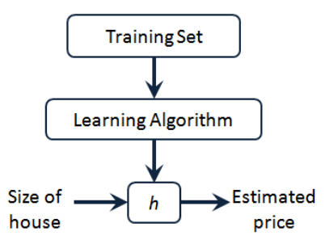

h 代表学习算法的解决方案或函数也称为假设（hypothesis）,h
 的表达方式有多种，其中一种可能的方式为：$h_θ(x)=θ_0+θ_1 x$，因为只含有一个特征/输入变量，因此这样的问题叫作单变量线性回归问题。

### 损失函数
对于回归问题，我们选择的参数决定了假设 h 相对于我们的训练集的准确程度，模型所预测的值与训练集中实际值之间的差距（下图中蓝线所指）就是建模误差（ modeling error）

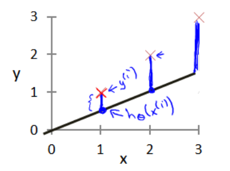

目标是选择出使得建模误差的平方和能够最小的模型参数，即损失函数（也称为目标函数）为：

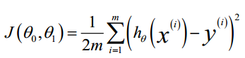

损失函数的选择有许多，比如SVM的折叶损失、softmax的熵损失，在回归模型选择平方误差损失是比较好的。对于一个损失函数的自变量是参数θ，以下是三维图：

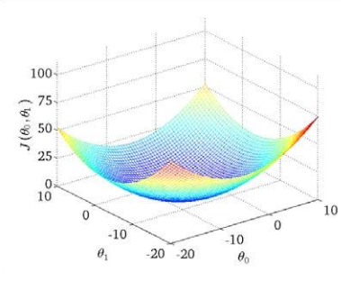

为了更好地拟合数据，需要一种有效的算法，能够自动地找出这些使代价函数 J 取最小值的参数$θ_0$和$θ_1$来,相当于找到损失函数的谷底。

### 梯度下降
梯度下降是一个用来求函数最小值的算法之一，适合求出代价函数$J(θ_0,θ_1)$的最小值。

梯度下降背后的思想是：开始时我们随机选择一个参数的组合$(θ_0,θ_1,...,θ_n)$，计算代价函数，然后利用求梯度的方式寻找下一个能让代价函数值下降最多的参数组合，持续这么做直到到到
一个局部最小值（ local minimum）；因为我们并没有尝试完所有的参数组合，所以不能确定我们得到的局部最小值是否便是全局最小值（ global minimum），选择不同的初始参数组合，可能会找到不同的局部最小值。

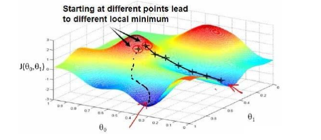

梯度下降的算法如下：

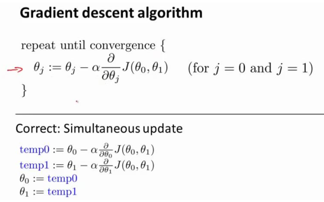

其中α为学习率，决定沿着能让代价函数下降程度最大的方向向下迈出的步子有多大；损失函数J是由m个数据得出的，称为批量梯度下降。在批量梯度下降中，每一次都同时让所有的参数减去学习速率乘以代价函数的导数。

### 梯度下降的线性回归
将梯度下降算法应用于具体的拟合直线的线性回归算法里，梯度下降算法和线性回归算法比较如图：

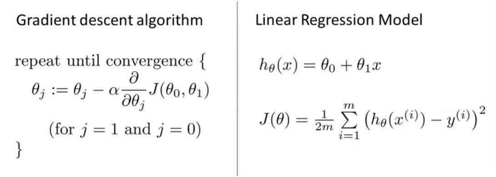

根据微积分求导法则，改写算法为：

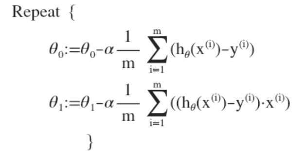

除了梯度下降算法，计算代价函数 J 最小值有数值解法，它可以在不需要多步梯度下降的情况下，也能解出代价函数 J 的最小值，这是另一种称为正规方程(normal equations)的方法。实际上在数据量较大的情况下，梯度下降法比正规方程要更适用一些。

### 线性代数
矩阵和向量提供了一种有效的方式来组织大量的数据，特别是当我们处理巨大的训练集时，通过线性代数泛化梯度下降算法。
加法和标量乘法：

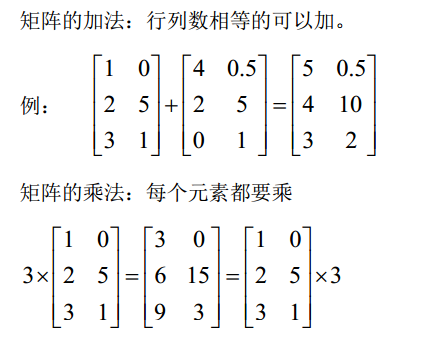

向量乘法，记住一行与一列相乘得一个数：

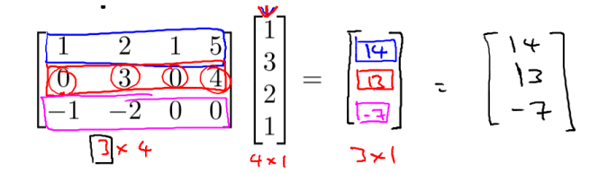

矩阵乘法，记住矩阵与一列相乘得一列（向量乘法）：

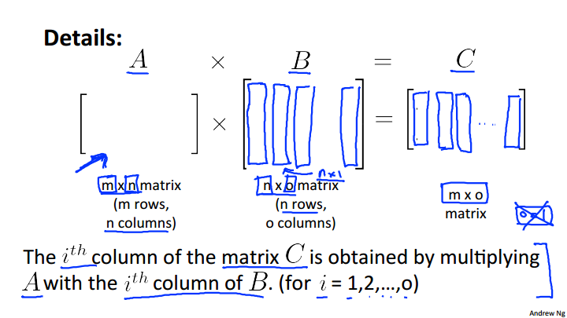

矩阵乘法性质：
- 不满足交换律：A×B≠B×A
- 满足结合律：A×（B×C） =（A×B）×C
- 单位矩阵：用 I 代表单位矩阵，从左上角到右下角的对角线（称为主对角线）上的元素均为 1 以外全都为 0，满足性质：AI=IA=A

逆：

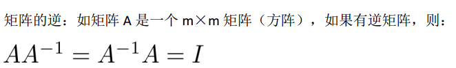

转置：

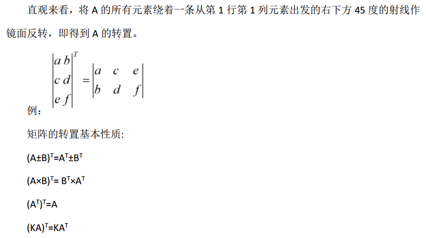