> 查看公式请安装插件[GitHub with MathJax](https://chrome.google.com/webstore/detail/github-with-mathjax/ioemnmodlmafdkllaclgeombjnmnbima)
<!-- TOC -->

- [逻辑斯蒂](#逻辑斯蒂)
- [决策边界](#决策边界)
- [损失函数](#损失函数)
- [高级优化算法](#高级优化算法)
- [多类别分类：一对多](#多类别分类一对多)

<!-- /TOC -->
### 逻辑斯蒂
利用线性回归算法解决分类问题，相当于使用直线拟合数据分布，再划分界限值分类。如下图所示，由于其预测值可以超越[0,1]的范围，阈值不易划分或者说拟合数据不优秀。

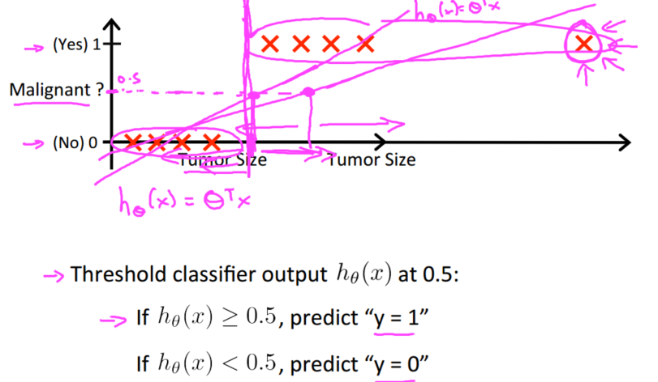

逻辑斯蒂回归算法虽然包含回归，实际上是一种分类算法，适用于标签 y 取值离散的情况，性质是：输出值永远在0到1之间，更适合分类问题。（不要翻译为逻辑回归）

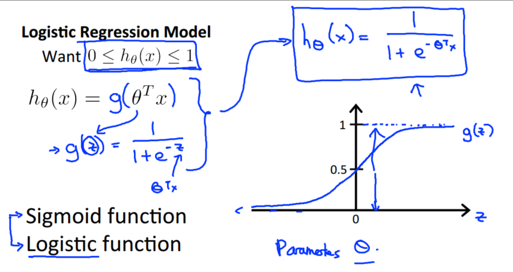

其中，$h_θ(x)$的作用是，对于给定的输入变量，根据选择的参数计算输出变量为1的可能性（estimated probablity）

### 决策边界
逻辑斯蒂回归将线性回归预测的分界扭曲到0

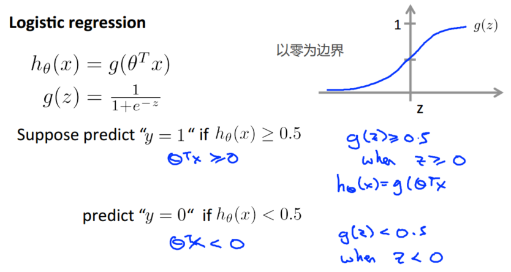

对于线性预测的分界总是直线，遇到复杂的数据分布需要加入非线性，比如平方等


### 损失函数
在线性回归模型中，代价函数是所有模型误差的平方和。如果逻辑回归模型沿用这个定义，得到的代价函数将是一个非凸函数。这意味着代价函数有许多局部最小值，将影响梯度下降算法寻找全局最小值。

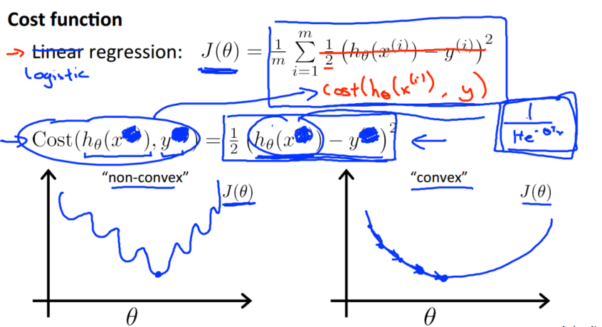

重新定义损失函数为：


$h_θ(x)$与$Cost(h_θ(x),y)$之间的关系如下图所示：

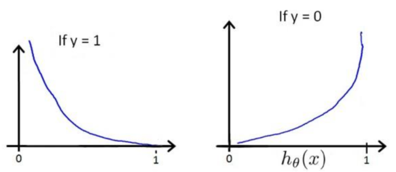

化简得到整个损失函数公式，代价函数 J(θ)会是一个凸函数，并且没有局部最优值：

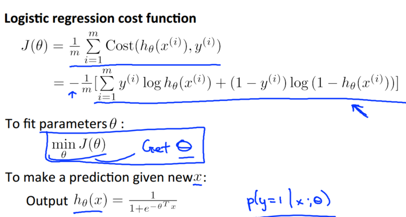

同样利用梯度下降优化参数，对新的损失函数求导，得到与线性回归相同的式子：

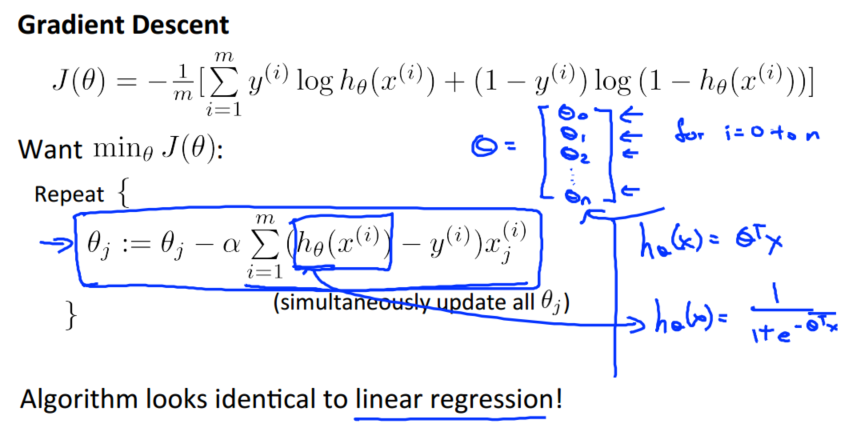

注意，线性回归和逻辑回归不是同一个算法，虽然梯度下降的式子没变化但是预测函数的定义变化了

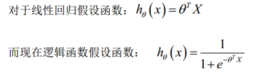

特征缩放提高梯度下降的收敛速度也适用于逻辑回归。

### 高级优化算法
最小化损失函数J(θ)时，通常需要计算J(θ)和$\nabla J(θ)$，在通过优化算法找到合适的最优参数θ，以下有多种算法选择：

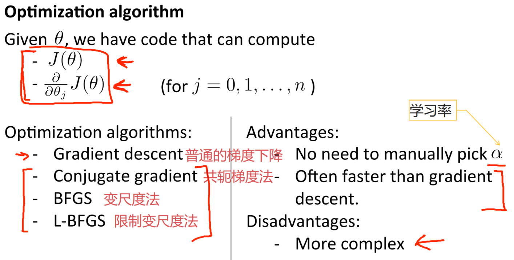

实际上不需要编写算法代码，调用高级的优化算法函数即可，但需要提供J(θ)和$\nabla J(θ)$等参数。

```matlab
% 求代价函数和偏导数项
function [jVal, gradient]=costFunction(theta)
  jVal=(theta(1)-5)^2+(theta(2)-5)^2;
  gradient=zeros(2,1);
  gradient(1)=2*(theta(1)-5);
  gradient(2)=2*(theta(2)-5);
end

% 设置选项，比如优化算法类型，迭代次数等
options=optimset('GradObj','on','MaxIter',100);
% 初始化θ值
initialTheta=zeros(2,1);
% 优化算法黑箱，返回最优θ
[optTheta, functionVal, exitFlag]=fminunc(@costFunction, initialTheta, options);
```

### 多类别分类：一对多
实际应用中，面对的更多分类问题是多分类而不是二分类，可以将一个多分类问题化简为多个二分类问题（即一对多思想）：

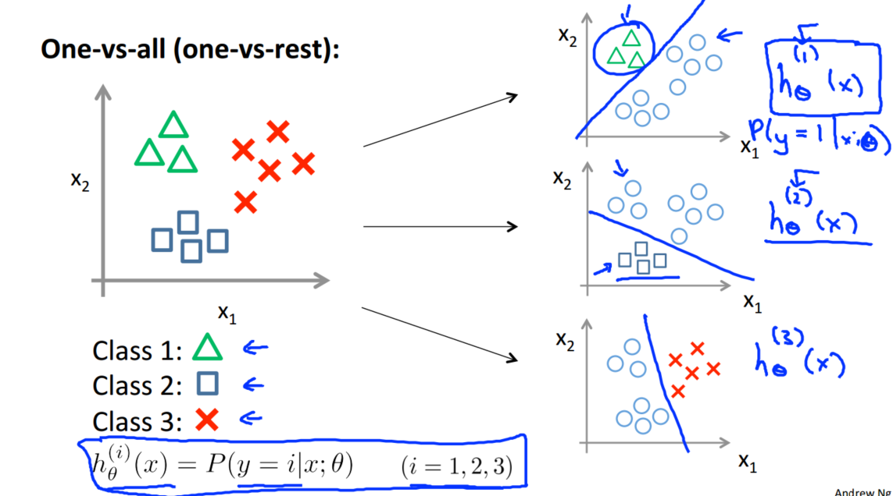

为了能实现这样的转变，将多个类中的某个类标记为正向类（y=1），然后将其他所有类都标记为负向类，训练出多个二元分类器。预测时，每个分类器输入一个新的 x 值，得到每个分类器的输出$h_θ^{(i)}(x)$，再选择最大值的类别即$max_i h_θ^{(i)}(x)$。

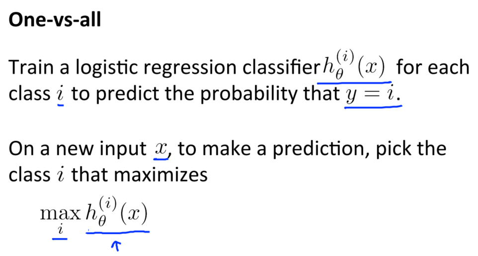