> 查看公式请安装插件[GitHub with MathJax](https://chrome.google.com/webstore/detail/github-with-mathjax/ioemnmodlmafdkllaclgeombjnmnbima)
<!-- TOC -->

- [非线性假设](#非线性假设)
- [神经网络模型](#神经网络模型)
- [前向传播](#前向传播)
- [损失函数](#损失函数)
- [反向传播算法](#反向传播算法)
- [梯度检验](#梯度检验)
- [随机初始化](#随机初始化)
- [总结](#总结)

<!-- /TOC -->

> 之前学习过线性回归和logistic回归，两者都是线性分类器（logistic的损失函数是非线性但预测是线性的），接下来学习解决多项式回归问题的神经网络。

### 非线性假设
使用非线性的多项式项，能够帮助我们建立更好的分类模型。构建一个非线性的多项式模型，却发现有数量非常惊人的特征组合，计算的负荷非常大。比如 50x50 像素的小图片，若将所有的像素视为特征，进一步构成一个多项式模型会造成特征爆炸。

普通的回归模型不能有效地处理这么多的特征，这时需要神经网络（NN），NN能够通过学习得出其自身的一系列高维特征，既能解决非线性回归问题又不受数据中原始特征的限制。

### 神经网络模型
仿人脑神经元系统，神经网络模型建立在很多神经元之上，而每个神经元又是一个学习模型。

神经元（也叫激活单元，activation unit）采纳一些特征作为输出，并且根据本身的模型提供一个输出。下图是一个以逻辑回归模型作为自身学习模型的神经元示例，在神经网络中，参数被称为权重（weight）

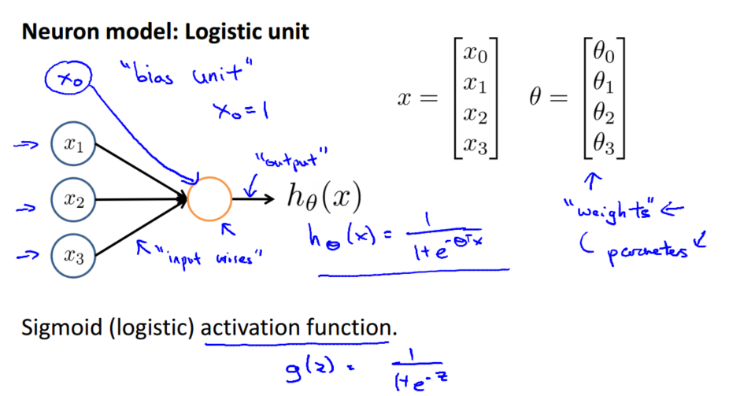

神经网络模型是许多逻辑单元按照不同层级组织起来的网络，每一层的输出变量都是下一层的输入变量。下图为一个 3 层的神经网络，第一层成为输入层（Input Layer），最后一层称为输出层（Output Layer），中间一层成为隐藏层（Hidden Layers），并为每一层都增加一个偏差单位（bias unit）。

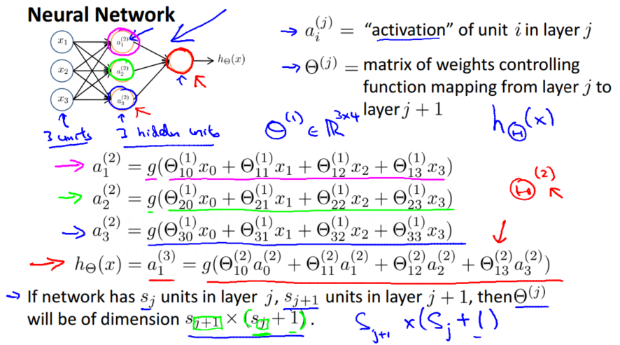

标注方式：$a^{(j)}_i$代表第 j 层的第 i 个激活单元。$θ^{(j)}$代表从第 j 层映射到第 j+1 层时的权重的矩阵，例如$θ^{(1)}$代表从第一层映射到第二层的权重的矩阵。其尺寸为：以第 j+1 层的激活单元数量为行数，以第 j 层的激活单元数加一为列数的矩阵。

### 前向传播
将所有操作向量化：

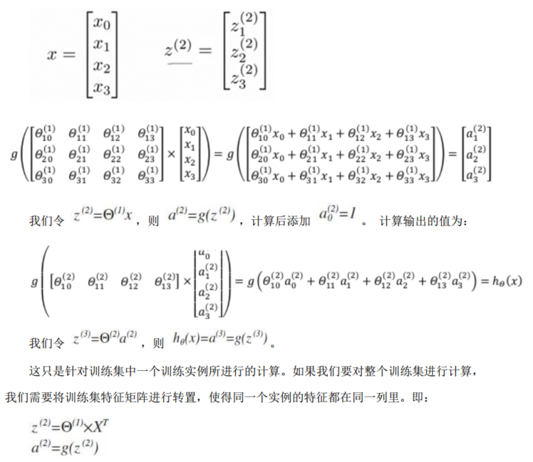

在前向传播的过程中，每一层的神经元输出 a 可以看作相对前一层输入 x 更高级的特征值，也就是 x 的进化体，并且它们是由 x 与决定的。

输出层神经元相当于 logistic regression，只不过我们把 logistic regression 中的输入向量[x1~x3]变成了中间层的[a1~a3]。

更高级的特征值远比原始数据 x 或者 x 的多项式厉害，也能更好的预测新数据。

对于多类别分类问题，输出层的神经元个数等于类别数即可，仍相当于一个分类器，而logistic回归属于利用多个分类器：

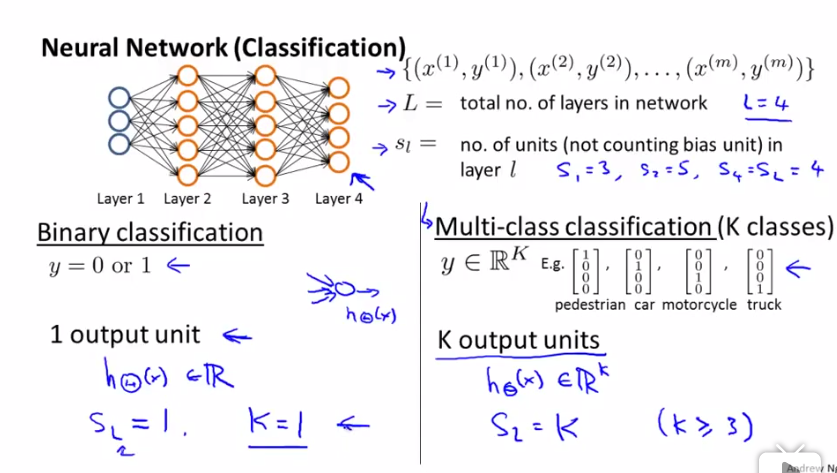

### 损失函数
神经网络有K个输出单元，当K=1时退化为类似logistic回归相似的损失函数，但注意 h(x) 的定义是不同的。

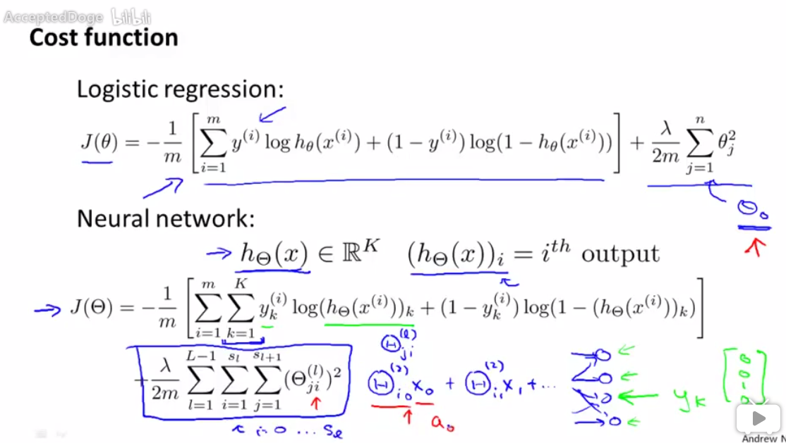

### 反向传播算法
前向传播算法：

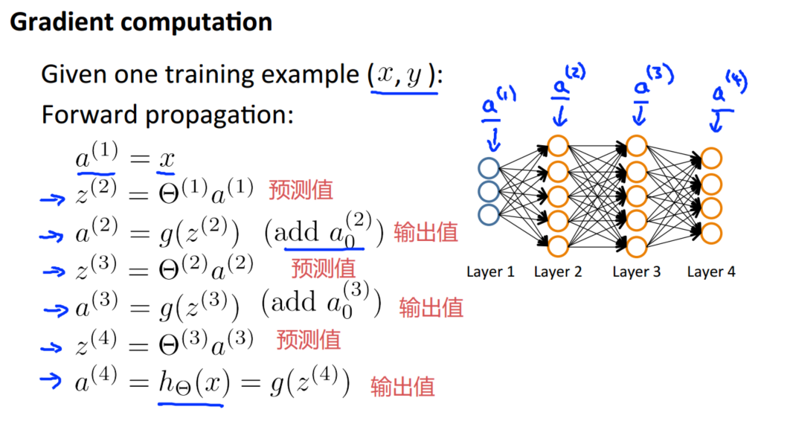

从最后一层的误差（微分）算起，反向传播：

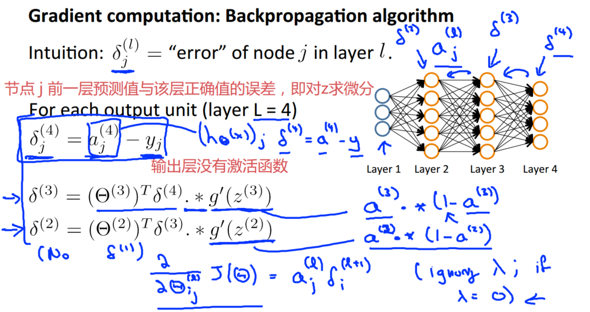

帮助理解：

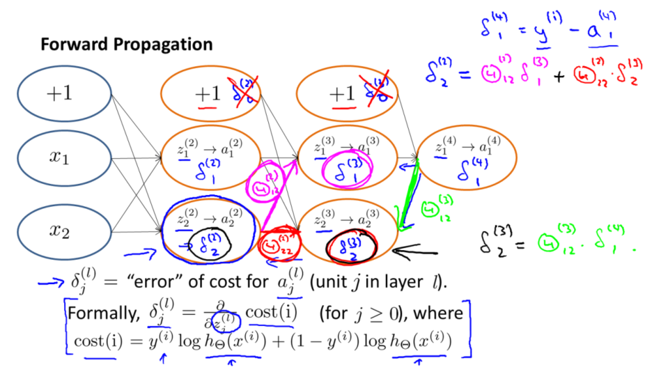

参数更新算法：

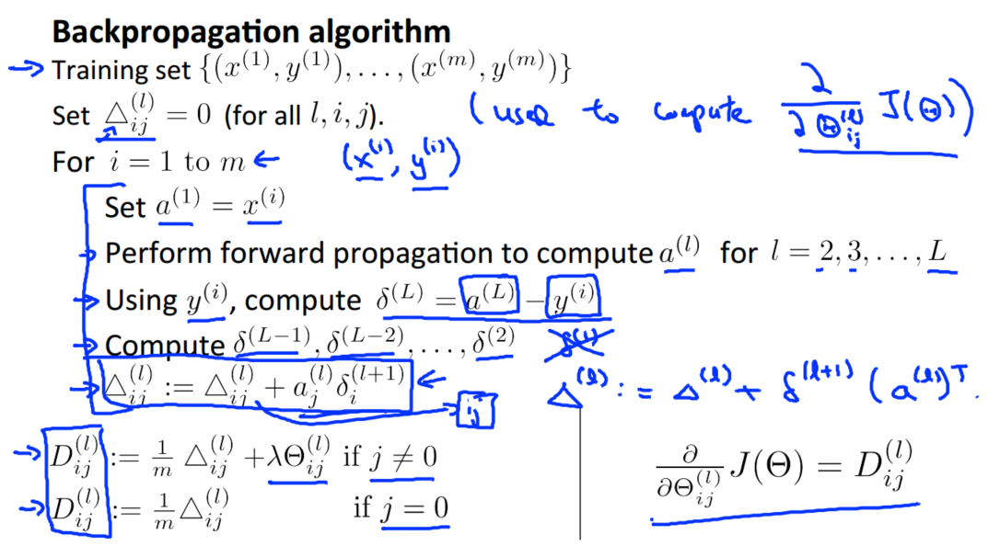

若使用 fminuc 这样的优化算法来求解求出权重矩阵，需要将矩阵首先展开成为向量，在利用算法求出最优解后再重新转换回矩阵。

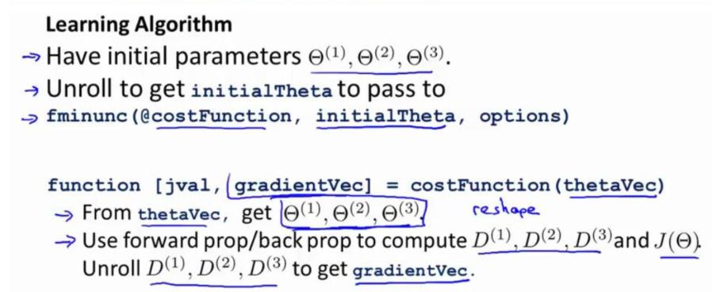

### 梯度检验
当我们对一个较为复杂的模型（例如神经网络）使用梯度下降算法时，可能会存在一些不容易察觉的错误，意味着虽然代价看上去在不断减小，但最终的结果可能并不是最优解。为了避免这样的问题，我们采取一种叫做梯度的数值检验（Numerical Gradient Checking）方法。

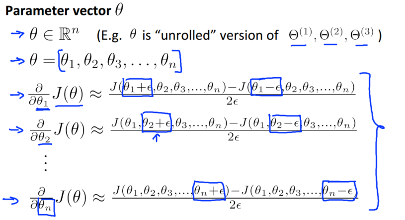

```matlab
%参考代码
for i = 1:n,
    thetaPlus = theta;
    thetaPlus(i) = thetaPlus(i) + EPSILON;
    thetaMinus = theta;
    thetaMinus(i) = thetaMinus(i) – EPSILON;
    gradApprox(i) = (J(thetaPlus) – J(thetaMinus))/(2*EPSILON);
end;
```
训练网络之前确保数值计算的梯度和分析计算的梯度相近，在训练时可关闭数值检验以防训练过慢。

### 随机初始化
任何优化算法都需要一些初始的参数。初始所有参数为 0 或者同一个非 0 的数，这样的初始方法对于逻辑回归来说是可行的，但是对于神经网络来说是不可行的。

初始值相同（对称权重）意味着所有激活单元都会有相同的值，权重值在更新过程中也具有相同值，最终网络的权重值都是相同的，网络性能较差。

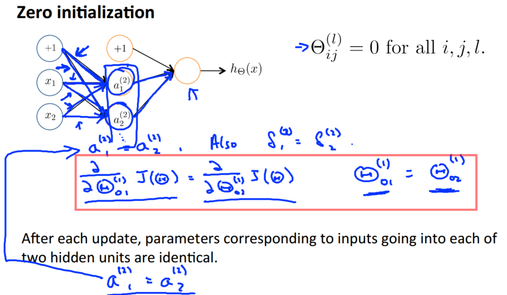

使用随机初始化打破对称性

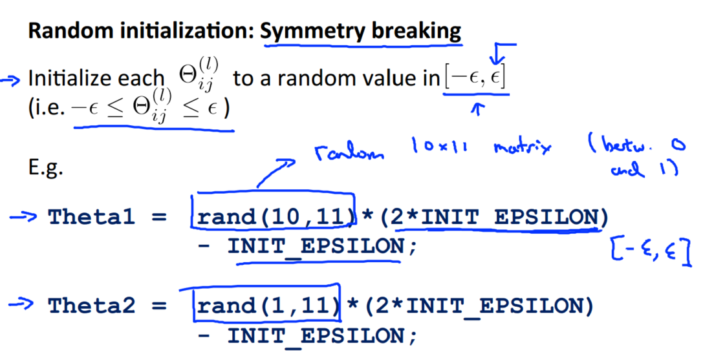

### 总结
网络结构：决定选择多少层以及决定每层分别有多少个单元。
- 第一层的单元数即我们训练集的特征数量
- 最后一层的单元数是我们训练集的结果的类的数
- 如果隐藏层数大于 1，确保每个隐藏层的单元个数相同，通常情况下隐藏层单元的个数越多越好

训练神经网络：
1. 参数的随机初始化
2. 利用正向传播方法计算所有的 hθ(x)
3. 编写计算代价函数 J 的代码
4. 利用反向传播方法计算所有偏导数
5. 利用数值检验方法检验这些偏导数
6. 使用优化算法来最小化代价函数