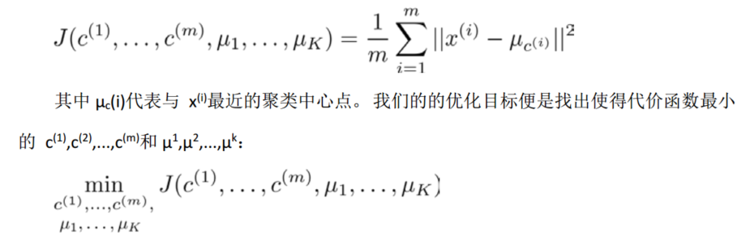
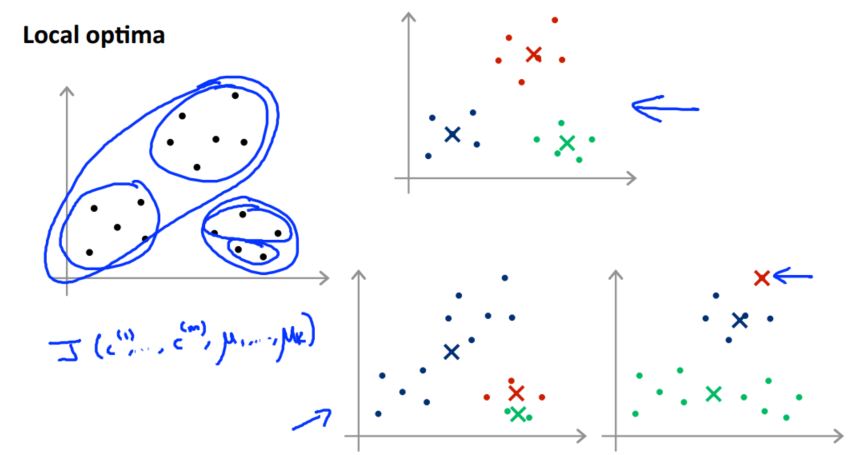
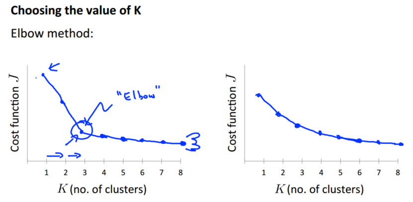

> 查看公式请安装插件[GitHub with MathJax](https://chrome.google.com/webstore/detail/github-with-mathjax/ioemnmodlmafdkllaclgeombjnmnbima)
<!-- TOC -->

- [简介](#简介)
- [K-Means算法](#k-means算法)
- [优化目标](#优化目标)
- [随机初始化](#随机初始化)
- [选择聚类数](#选择聚类数)

<!-- /TOC -->
### 简介
在监督学习中，训练集的数据是有标签的，我们的目标是据此拟合一个假设函数或者说找到区分正样本和负样本的决策边界。而非监督学习中的训练集是无标签数据，写成$x^{(1)},x^{(2)}…x^{(m)}$，任务是根据特征找到数据的内在结构。

聚类就是通过算法把数据分成不同的簇（点集），k均值算法是其中一种重要的聚类算法，应用场景是市场分割、社交网络分析等。

### K-Means算法
K-Means是一个迭代算法，假设我们想要将数据聚类成 K 个组，其方法为:
- 首先选择 K 个随机的点，称为聚类中心（ cluster centroids） ；
- 对于数据集中的每一个数据，按照距离 K 个中心点的距离，将其与距离最近的中心点关联起来，与同一个中心点关联的所有点聚成一类。
- 计算每一个组的平均值，将该组所关联的中心点移动到平均值的位置。
- 重复步骤 2-4 直至中心点不再变化。

用$μ_1,μ_2,...,μ_k$来表示聚类中心，用$c(1),c(2),...,c(m)$来存储与第 i 个实例数据最近的聚类中心的索引， K-Means算法的伪代码如下：
```
Repeat {
for i = 1 to m
c(i):= index (from 1 to K) of cluster centroid closest to x(i)

for k = 1 to K
μk := average (mean) of points assigned to cluster k
}
```
算法分为两个步骤，第一个 for 循环是赋值步骤，即：对于每一个样例 i，计算其应该属于的类。第二个 for 循环是聚类中心的移动，即：对于每一个类 k，重新计算该类的质心。

### 优化目标
K-Means最小化问题，是要最小化所有的数据点与其所关联的聚类中心点之间的距离之和，因此 K-Means的代价函数（又称畸变函数 Distortion function）为：



回顾 K-Means 迭代算法，第一个循环是用于减小 c(i)引起的代价，而第二个循环则是用于减小 μi 引起的代价。迭代的过程一定会是每一次迭代都在减小代价函数，不然便是出现了错误。

### 随机初始化
在运行 K-Means 算法的之前，首先要随机初始化所有的聚类中心点：
1. 我们应该选择 K<m，即聚类中心点的个数要小于所有训练集实例的数量
2. 随机选择 K 个训练实例，然后令 K 个聚类中心分别与这 K 个训练实例相等

K-Means 的一个问题在于，它有可能会停留在一个局部最小值处，而这取决于初始化的情况，如下图所示不同初始化有不同结果：



为了解决这个问题，我们通常需要多次运行 K-均值算法，每一次都重新进行随机初始化，最后再比较多次运行 K-Means 的结果，选择代价函数最小的结果。这种方法在 K 较小的时候（2~10）还是可行的，但是如果 K 较大，这么做可能不会有明显地改善。

### 选择聚类数
没有所谓最好的选择聚类数的方法，通常是需要根据不同的问题，人工进行选择的。选择的时候思考我们运用 K-Means 算法聚类的动机是什么，然后选择能最好服务于该目标的聚类数。

“肘部法则”：改变 K 值再运行 K-Means 算法，然后计算成本函数或者计算畸变函数 J，绘图如下：



规律：不同 K 值及其损失函数 J 的图案如同肘部，其肘关节对应的聚类个数是最合理的，实际工程中运用“肘部法则”有很大的帮助。