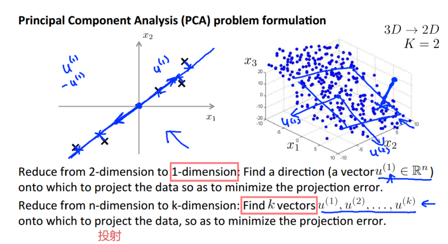
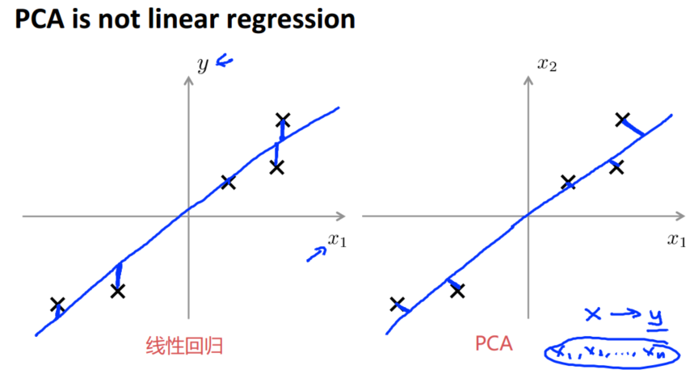
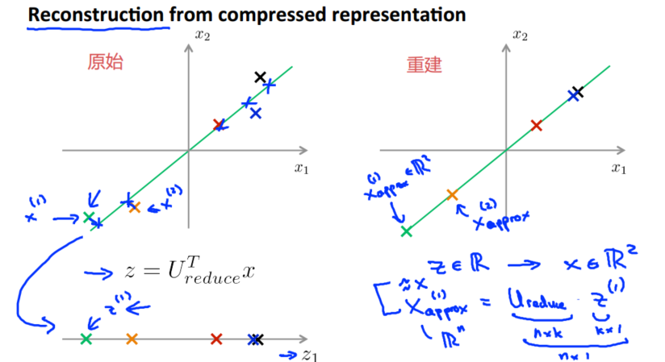
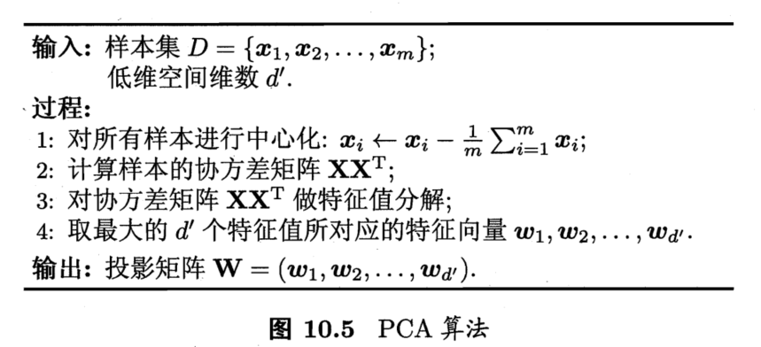
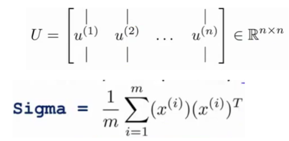
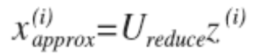
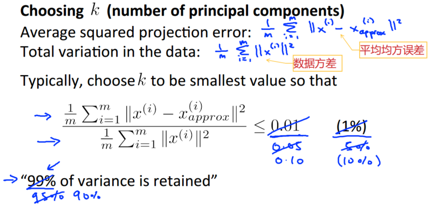
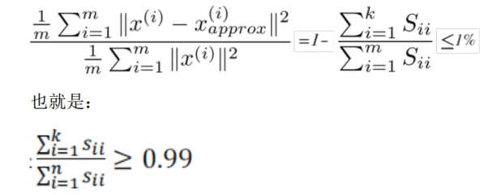
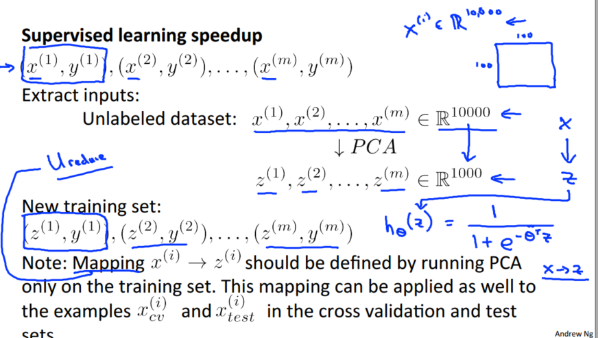

> 查看公式请安装插件[GitHub with MathJax](https://chrome.google.com/webstore/detail/github-with-mathjax/ioemnmodlmafdkllaclgeombjnmnbima)
<!-- TOC -->

- [动机](#动机)
- [主成分分析（PCA）](#主成分分析pca)
- [PCA算法](#pca算法)
- [选择主成分数量](#选择主成分数量)
- [应用建议](#应用建议)

<!-- /TOC -->
### 动机
一是数据压缩，不仅使用较少的计算机内存或磁盘空间，还可以加快学习算法。

二是数据可视化，将高维数据降至3维或者2维就能将其可视化。

### 主成分分析（PCA）
主成分分析（PCA）是最常见的降维算法，内容是找到一个或多个方向向量（Vector direction，相当于新坐标轴），当把所有的数据都投射到该向量上时，投射平均均方误差能尽可能地小。



主成分分析与线性回归是两种不同的算法。
- 主成分分析最小化的是投射误差（Projected Error） ， 而线性回归尝试的是最小化预测误差。
- 线性回归的目的是预测结果，而主成分分析不作任何预测



PCA 技术的特点：
- 对数据进行降维的处理。我们可以对新求出的“主元”向量的重要性进行排序，根据需要取前面最重要的部分，将后面的维数省去，可以达到降维从而简化模型或是对数据进行压缩的效果。同时最大程度的保持了原有数据的信息。
- 它是完全无参数限制的。在 PCA 的计算过程中完全不需要人为的设定参数或是根据任何经验模型对计算进行干预，最后的结果只与数据相关。好处是与用户是独立的；坏处是如果用户对观测对象有一定的先验知识，掌握了数据的一些特征，却无法通过参数化等方法对处理过程进行干预，可能会得不到预期的效果，效率也不高。

由压缩特征重建原始信号，可见与原始数据相当相似：



### PCA算法
主要成分分析目标函数是减少投射的平均均方误差，最终可推导出以下算法



在 matlab 里可以利用奇异值分解（singular value decomposition）来求解SVM算法，代码为：
```matlab
[U, S, V]=svd(sigma);
Ureduce = U(:,1:k); %选择前几个特征向量
z = Ureduce’*x;%主成分分析的解
```
其中标注为：



我们只需要从 U 中选取前 K 个向量，获得一个 n×k 维度的矩阵，用$U_{reduce}$表示，然后通过如下计算获得要求的新特征向量$z^{(i)}=U_{reduce} \times x^{(i)}$

在压缩过数据后，我们可以采用如下方法来近似地获得原有的特征：



### 选择主成分数量
平均均方误差与训练集方差的比例表示维度压缩比例的倒数，通常情况下，我们希望能在满足压缩比例尽可能大的情况下选择尽可能小的 K 值。



我们可以先令 K=1，然后进行主要成分分析，获得 Ureduce 和 z，然后计算比例是否小于1%。如果不是的话再令 K=2，如此类推，直到找到可以使得比例小于 1% 的最小 K 值（原因是各个特征之间通常情况存在某种相关性）。

还有一些更好的方式来选择 K，在 matlab 中调用“svd”函数的时候获得三个参数：`[U, S, V] = svd(sigma)`。其中的 S 是一个 n×n 的矩阵，只有对角线上有值，而其它单元都是 0，我们可以使用这个矩阵来计算平均均方误差与训练集方差的比例：



### 应用建议
一般情况下，应用PCA的目的是：压缩数据量，加速算法以及方便可视化



常见错误1：
使用主要成分分析的情况是，将其用于减少过拟合（减少了特征的数量），原因在于主成分分析只是近似地丢弃掉一些特征，它并不考虑任何与结果变量有关的信息，因此可能会丢失非常重要的特征。

> 不如尝试归一化处理，当我们进行归一化处理时，会考虑到结果变量，不会丢掉重要的数据。

常见的错误2：
默认地将主要成分分析作为学习过程中的一部分，这虽然很多时候有效果，最好还是从所有原始特征开始，只在有必要的时候（算法运行太慢或者占用太多内存）才考虑采用主要成分分析。
