> 查看公式请安装插件[GitHub with MathJax](https://chrome.google.com/webstore/detail/github-with-mathjax/ioemnmodlmafdkllaclgeombjnmnbima)
<!-- TOC -->

- [简介](#简介)
- [异常检测-高斯分布](#异常检测-高斯分布)
- [开发和评估](#开发和评估)
- [异常检测与监督学习对比](#异常检测与监督学习对比)
- [选择特征](#选择特征)
- [异常检测-多元高斯分布](#异常检测-多元高斯分布)

<!-- /TOC -->
### 简介
异常检测主要用于非监督学习问题，但从某些角度看，它又类似于一些监督学习问题。

给定数据集 x(1),x(2),..,x(m)，我们假使数据集是正常的，我们希望知道新的数据$x_{test}$是不是异常的，即这个测试数据属于该组数据的几率p(x)如何。

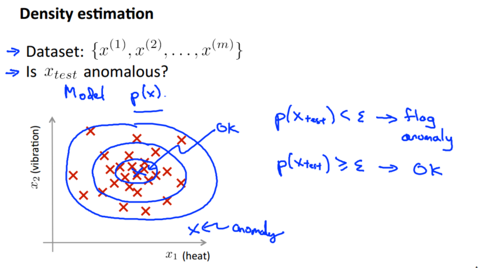

上图中，在蓝色圈内的数据属于该组数据的可能性较高，而越是偏远的数据，其属于该组数据的可能性就越低。这种方法称为密度估计，表达如下：

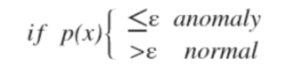

异常检测主要用来识别欺骗。例如在线采集而来的有关用户的数据，一个特征向量中可能会包含如：用户多久登录一次，访问过的页面，在论坛发布的帖子数量，甚至是打字速度等。尝试根据这些特征构建一个模型，可以用这个模型来识别那些不符合该模式的用户。

### 异常检测-高斯分布
此处应用高斯分布开发异常检测算法，通常如果我们认为变量 x 符合高斯分布 x~N(μ,σ2)，则其概率密度函数为：

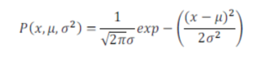

异常检测算法的步骤为：

对于给定的数据集 x(1),x(2),...,x(m)，针对每一个特征计算 μ 和 σ2 的估计值

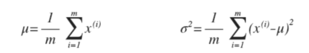

一旦我们获得了平均值和方差的估计值，给定新的一个训练实例，根据模型计算每一特征的$p(x_j)$再相乘得到$p(x)$：

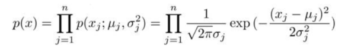

选择一个 ε，将 p(x)=ε 作为判定边界，当 p(x)>ε 时预测数据为正常数据，否则为异常。

### 开发和评估
通常我们需要一种方法来帮助检验算法是否有效，以做出更好的选择改善系统。

当我们开发一个异常检测系统时，我们从带标记（异常或正常）的数据着手，我们从其中选择一部分正常数据用于构建训练集，然后用剩下的正常数据和异常数据混合的数据构成交叉检验集和测试集。

具体的评价方法如下：
1. 根据测试集数据，我们估计特征的平均值和方差并构建p(x)函数
2. 对交叉检验集，我们尝试使用不同的 ε 值作为阀值，并预测数据是否异常，根据 F1 值或者查准率与查全率的比例来选择 ε
3. 选出 ε 后，针对测试集进行预测，计算异常检验系统的 F1 值，或者查准率与查全率之比，进而评估系统性能。

### 异常检测与监督学习对比
异常检测系统虽是无监督学习，但使用了带标记的数据，与监督学习有些相似，下面的对比有助于选择采用监督学习还是异常检测：

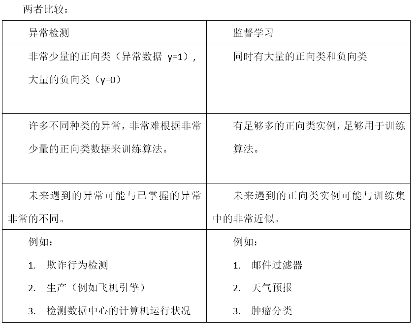

### 选择特征
对于异常检测算法，使用的特征是至关重要的，一般令特征符合高斯分布。如果数据的分布不是高斯分布，异常检测算法也能够工作，但是最好还是将数据转换成高斯分布，例如使用对数函数： x = log(x+c)，其中c>0；或者 x=x^c，其中c∈[0-1]。

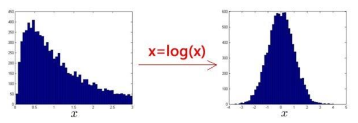

一个常见的问题是一些异常的数据可能也会有较高的p(x)值，因而被算法认为是正常的，此时需要进行误差分析，分析那些被算法错误预测为正常的数据，观察能否找出一些问题。从问题中发现我们需要增加一些新的特征，增加这些新特征后获得的新算法能够帮助我们更好地进行异常检测。

> 如果异常数据的某特征值异常地大或小，通过将一些相关的特征进行组合，来获得一些新的更好的特征

### 异常检测-多元高斯分布
假使我们有两个相关的特征，而且这两个特征的值域范围比较宽，这种情况下，一般的高斯分布模型不能很好地识别异常数据。其原因在于，一般的高斯分布模型尝试的是去同时抓住两个特征的偏差，因此创造出一个比较大的判定边界，容易将异常数据当作正常数据。

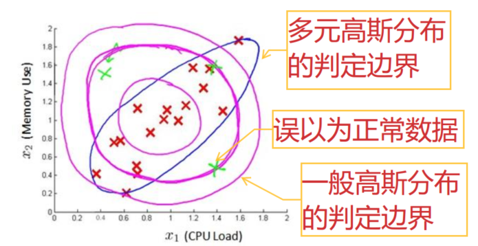

在一般的高斯分布模型中，计算p(x)的方法是：通过分别计算每个特征对应的几率然后将其累乘起来。

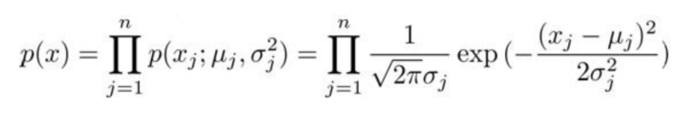

在多元高斯分布模型中，计算p(x)的方法是：首先计算所有特征的平均值，然后再计算协方差矩阵，用所有的特征一起来计算p(x)。

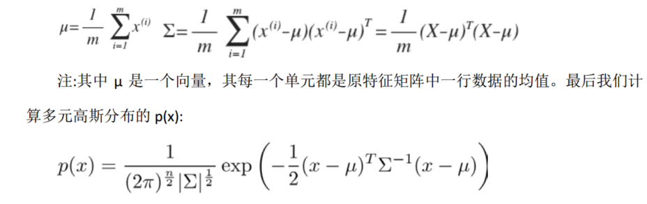

观察协方差矩阵 Σ 是如何影响模型的：

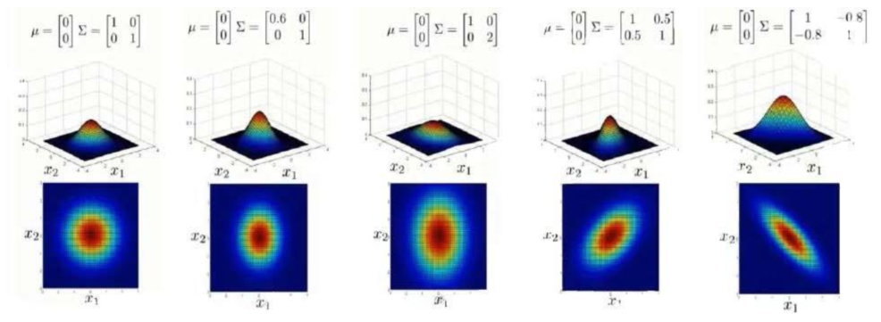

上图是 5 个不同的模型，从左往右依次分析：
1. 一个一般的高斯分布模型
2. 通过协方差矩阵，令特征 1 拥有较小的偏差，同时保持特征 2 的偏差
3. 通过协方差矩阵，令特征 2 拥有较大的偏差，同时保持特征 1 的偏差
4. 通过协方差矩阵，在不改变两个特征的原有偏差的基础上，增加两者之间的正相关性
5. 通过协方差矩阵，在不改变两个特征的原有偏差的基础上，增加两者之间的负相关性

多元高斯分布模型与原高斯分布模型的关系：原本的高斯分布模型是多元高斯分布模型的一个子集，如上图中的前3个例子所示，如果协方差矩阵只在对角线的单位上有非零的值时，即为一般的高斯分布模型。

在实际中使用多元高斯分布和多元正态分布：

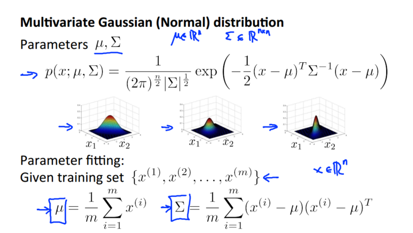

根据上图公式得出所需的模型P(x)，计算得P(x)<ε则为异常数据，否则为正常数据。对比原始模型和多元高斯模型：

两者比较如下：

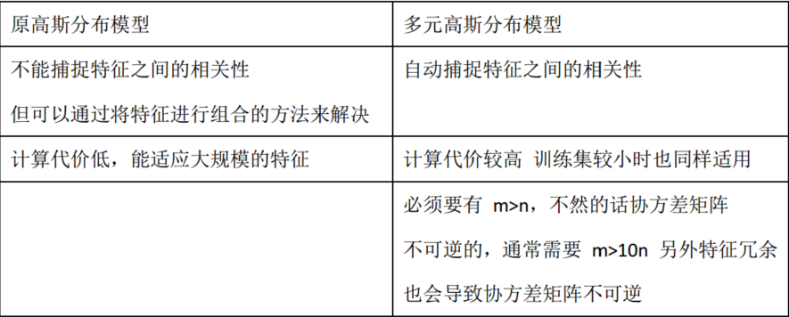

实际上，原高斯分布模型被广泛使用着，如果特征之间在某种程度上存在相互关联的情况，我们可以通过构造新特征的方法来捕捉这些相关性。如果训练集不是太大，并且没有太多的特征，可以使用多元高斯分布模型。
