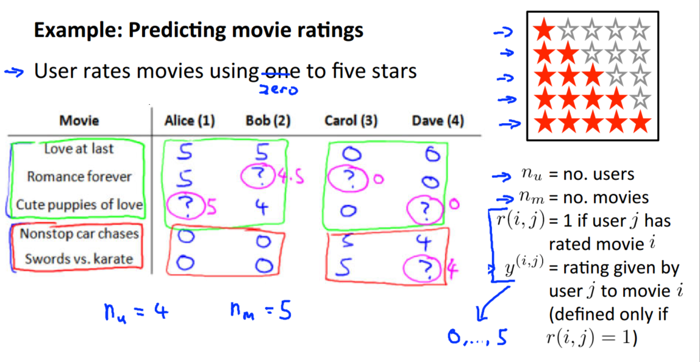
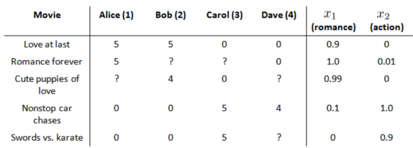
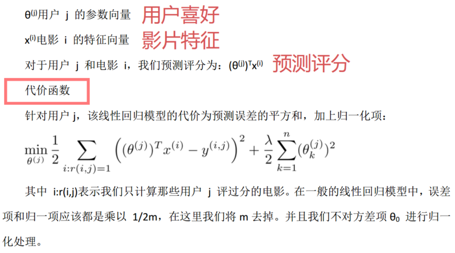
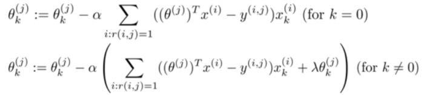
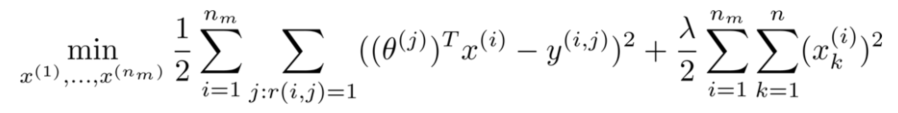
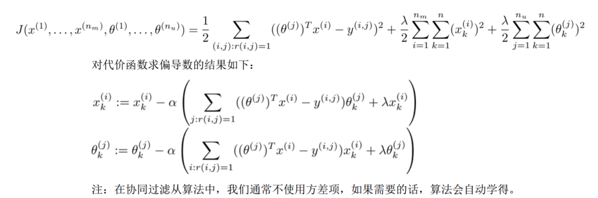
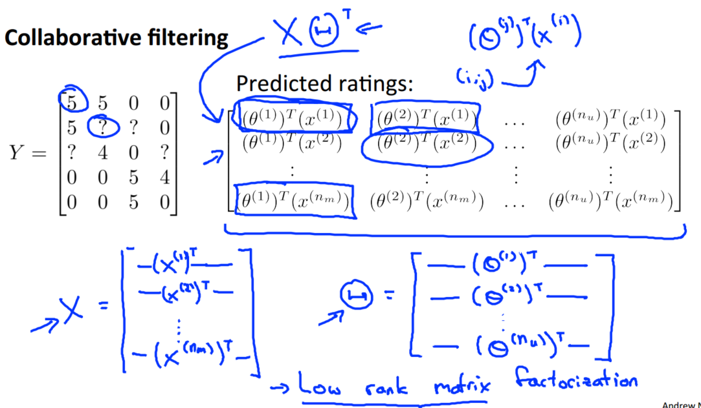
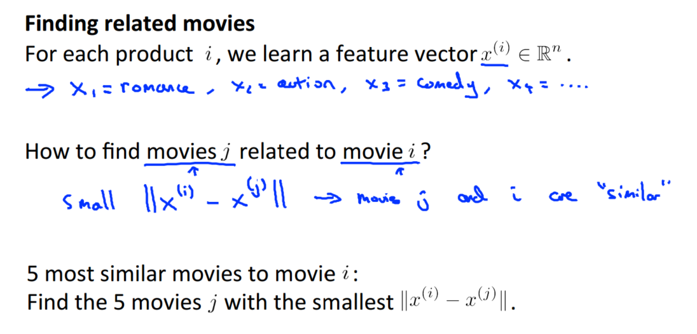
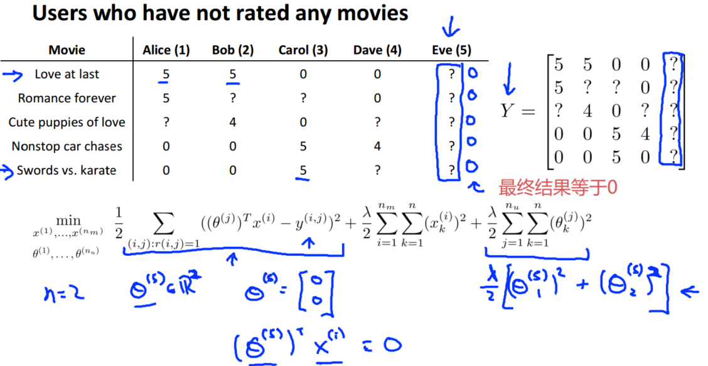

> 查看公式请安装插件[GitHub with MathJax](https://chrome.google.com/webstore/detail/github-with-mathjax/ioemnmodlmafdkllaclgeombjnmnbima)
<!-- TOC -->

- [简介](#简介)
- [基于内容的推荐系统](#基于内容的推荐系统)
- [协同过滤](#协同过滤)
- [向量化：低秩矩阵分解](#向量化低秩矩阵分解)
- [细节-均值归一化](#细节-均值归一化)

<!-- /TOC -->
### 简介
讲解推荐系统的原因：
- 推荐系统虽然在学术界占有很小的份额，但在科技企业中占据很高的优先级。
- 推荐系统有一种思想：算法自动学习一套好的特征

以下讲解以推荐电影为例，得到的数据如下：

### 基于内容的推荐系统
假设每部电影都有两个特征，如 x1 代表电影的浪漫程度，x2 代表电影的动作程度。

则每部电影都有一个特征向量，如x(1)是第一部电影的特征向量为[0.9 0]。

基于这些特征来构建一个推荐系统算法，假设针对每一个用户都训练一个线性回归模型，如$θ^{(1)}$是第一个用户的模型的参数，则有：

用梯度下降法来求解最优解，我们计算代价函数的偏导数后得到梯度下降的更新公式为：

### 协同过滤
在之前的基于内容的推荐系统中，掌握每一部电影的特征，使用这些特征训练出了每一个用户的参数。相反地，如果拥有用户的参数，我们可以学习得出电影的特征。

但是如果既没有用户的参数，也没有电影的特征，协同过滤算法可以同时学习这两者。

协同过滤算法使用步骤如下：
1. 初始 x(1),x(2),...,x(m)，θ(1),θ(2),...,θ(n)为一些随机小值
2. 使用梯度下降算法最小化代价函数
3. 在训练完算法后，我们预测$(θ^{(j)})^T x^{(i)}$为用户 j 给电影 i 的评分。

通过这个学习过程获得的特征矩阵包含了有关电影的重要数据，这些数据不总是人能读懂的，但是可以用这些数据作为给用户推荐电影的依据，这是算法的终极目标。

例如，如果一位用户正在观看电影 x(i)，我们可以寻找另一部电影 x(j)，依据两部电影的特征向量之间的距离||x(i)-x(j)||的大小。

### 向量化：低秩矩阵分解
关于协同过滤算法的向量化实现，仍以电影推荐为例：

> 低秩分解是指矩阵x乘以θ转置的低秩性质

学习得到某用户的电影特征，就有很方便的方法来度量两部电影之间的相似性，进而推荐电影：

### 细节-均值归一化
没有评分的新用户，在训练的过程由于正则化的原因使影片喜好 x 和电影特征 θ 都趋于零，系统无法正常推荐电影。

为解决该问题，通常将对所有电影评分取均值归一化,最终预测结果需要将平均值重新加回去，则新用户的电影特征为均值。

