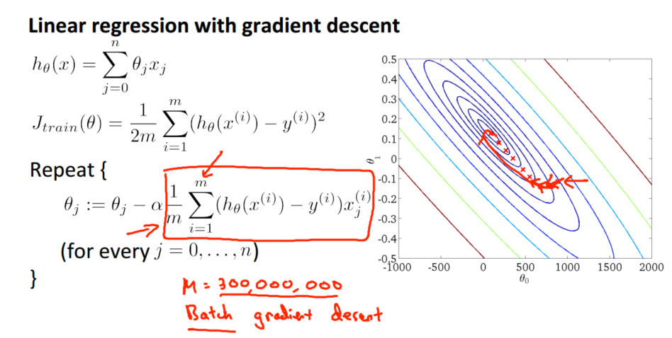
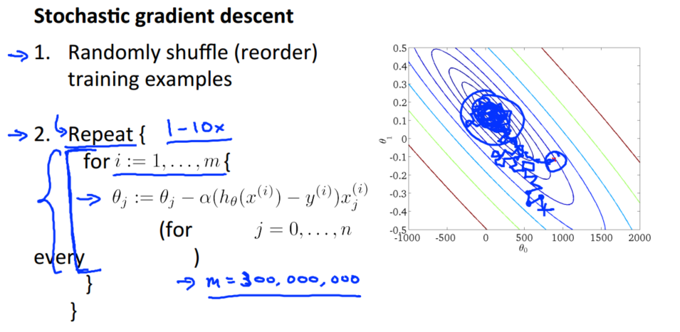
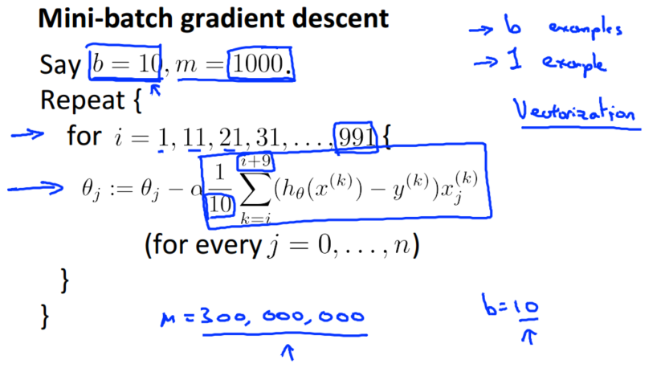
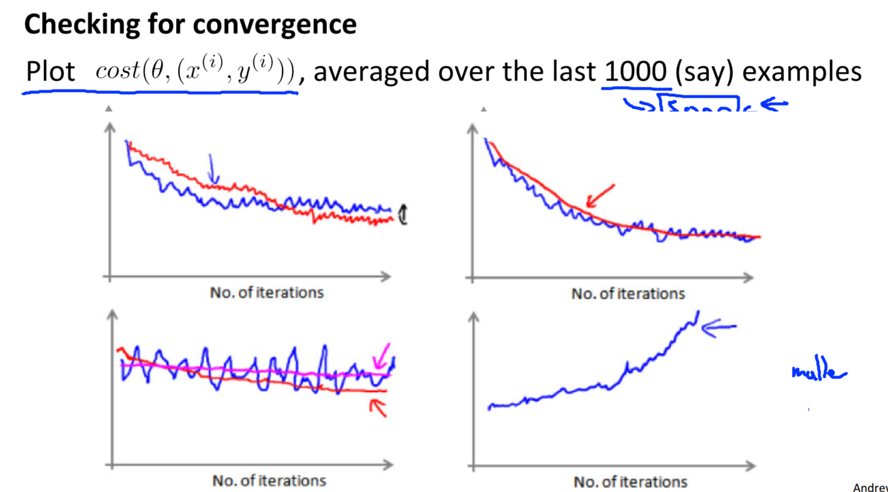
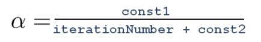
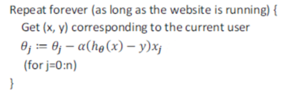

> 查看公式请安装插件[GitHub with MathJax](https://chrome.google.com/webstore/detail/github-with-mathjax/ioemnmodlmafdkllaclgeombjnmnbima)
<!-- TOC -->

- [梯度下降](#梯度下降)
- [在线学习](#在线学习)
- [映射化简和数据并行](#映射化简和数据并行)

<!-- /TOC -->
### 梯度下降
批量梯度下降：每次更新参数根据所有数据计算损失

随机梯度下降：每次更新参数随机抽取一个样本计算数据损失

小批量梯度下降：每次更新参数根据小部分数据计算数据损失

> 目标函数不变，只是计算损失函数改变

在随机梯度下降中，我们在每一次更新 θ 之前都计算一次代价，然后每 X 次迭代后，求出这 X 次对训练实例计算代价的平均值，然后绘制这些平均值与 X 次迭代的次数之间的函数图表，以检查算法是否收敛以及训练情况。

当我们绘制这样的图表时，可能会得到一个颠簸不平但是不会明显减少的函数图像（如上面左下图中蓝线所示）。我们可以增加 X 来使得函数更加平缓，也许便能看出下降的趋势了（如上面左下图中红线所示）；或者可能函数图表仍然是颠簸不平且不下降的（如洋红色线所示），那么我们的模型本身可能存在一些错误。

如果我们得到的曲线如上面右下方所示，不断地上升，那么我们可能会需要选择一个较小的学习率α。

随着不断地靠近全局最小值，通过减小学习率，我们迫使算法收敛而非在最小值附近徘徊。

### 在线学习
如果拥有一个由连续的用户流引发的连续的数据流，比如有名气的电商网站，可以使用一个在线学习机制，从数据流中学习用户的偏好而不是固定的数据库，然后使用这些信息来优化一些关于网站的决策。

在线学习的算法与随机梯度下降算法有些类似，不同在于在线学习对单一的实例进行学习，而非对一个提前定义的训练集进行循环。

一旦对一个数据的学习完成，便可以丢弃该数据，不需要再存储它了。这种方式的好处在于，我们的算法可以很好的适应用户的倾向性，算法可以针对用户的当前行为不断地更新模型以适应该用户。

### 映射化简和数据并行
映射简化：用批量梯度下降算法来求解大规模数据集的最优解，计算代价非常大，能够将数据集分配给不多台计算机，让每一台计算机并行处理数据集的一个子集，然后将结果汇总再求和。

例如，我们有 400 个训练实例，我们可以将批量梯度下降的求和任务分配给 4 台计算机进行处理：

很多高级的线性代数函数库已经能够利用多核 CPU 的多个核心来并行地处理矩阵运算，这也是算法的向量化实现如此重要的缘故（比调用循环快）。