> 查看公式请安装插件[GitHub with MathJax](https://chrome.google.com/webstore/detail/github-with-mathjax/ioemnmodlmafdkllaclgeombjnmnbima)
<!-- TOC -->

- [多维特征](#多维特征)
- [多变量梯度下降](#多变量梯度下降)
- [技巧：特征缩放](#技巧特征缩放)
- [技巧：学习率](#技巧学习率)
- [特征和多项式回归](#特征和多项式回归)
- [正规方程](#正规方程)
- [正规方程及不可逆性](#正规方程及不可逆性)

<!-- /TOC -->
### 多维特征
了解单变量特征的回归模型后，不妨对房价模型增加更多的特征，例如房间数楼层等，构成一个含有多个变量的模型，模型中的特征为$(x_1,x_2,...,x_n)$。

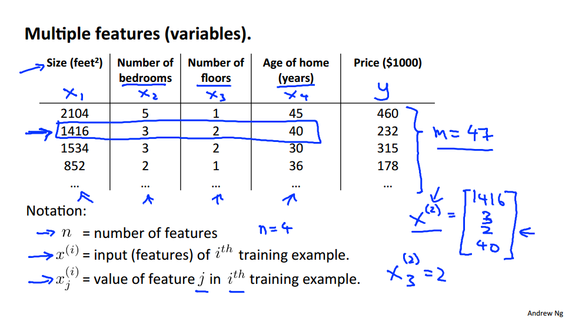

更新注释方式：
- n 代表特征的数量
- $x^{(i)}$代表第 i 个训练实例，是特征矩阵中的第 i 行，是一个向量(vector)
- $x^{(i)}_j$代表特征矩阵中第 i 行的第 j 个特征，也就是第 i 个训练实例的第 j 个特征。
- 支持多变量的假设 h 表示为：$h_θ(x)=θ_0+θ_1x_1+θ_2x_2+...θ_nx_n$

### 多变量梯度下降
与单变量线性回归类似，构建多变量回归模型：

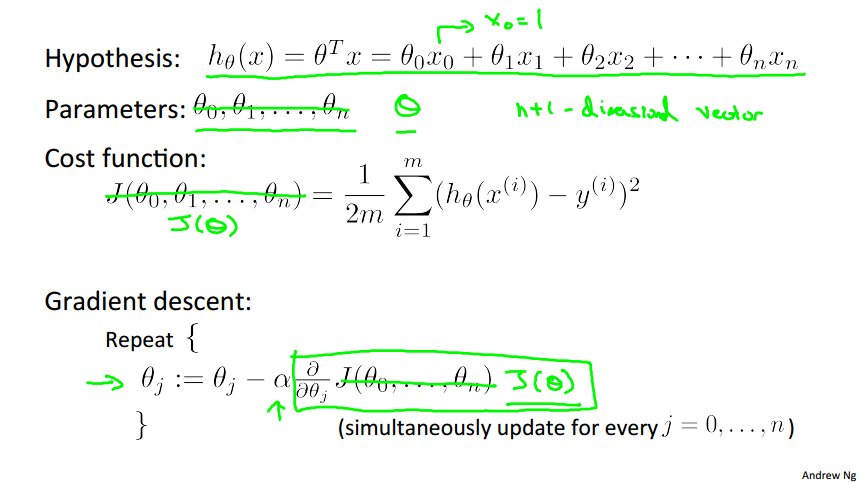

多变量线性回归的批量梯度下降算法为：

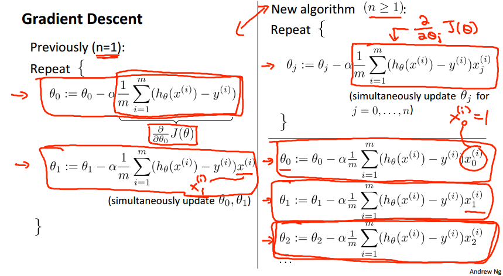

### 技巧：特征缩放
将特征统一在-1~1的范围内，否则代价函数的等高线图显得奇形怪状，梯度下降算法需要非常多次的迭代才能收敛。常用的是均值归一化：

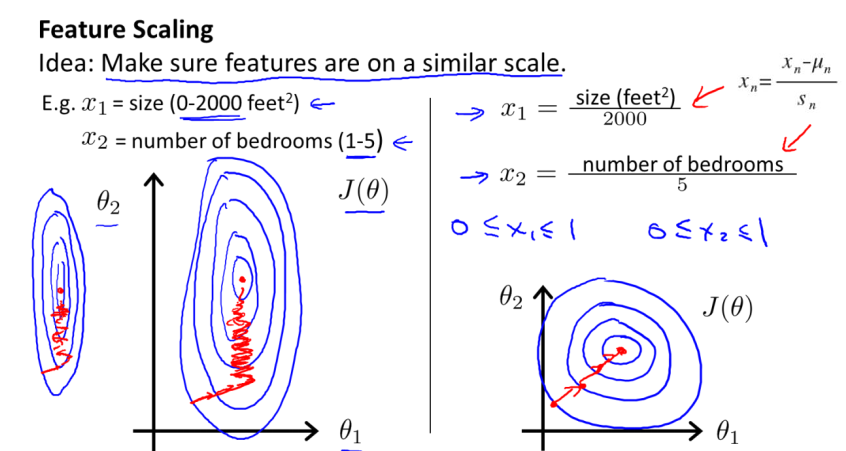

### 技巧：学习率
为确保梯度下降算法工作正常，可以绘制迭代次数和代价函数的图表来观测算法，常常将代价函数的变化值与某个阀值（例如 0.001）进行比较来判断收敛的时刻。

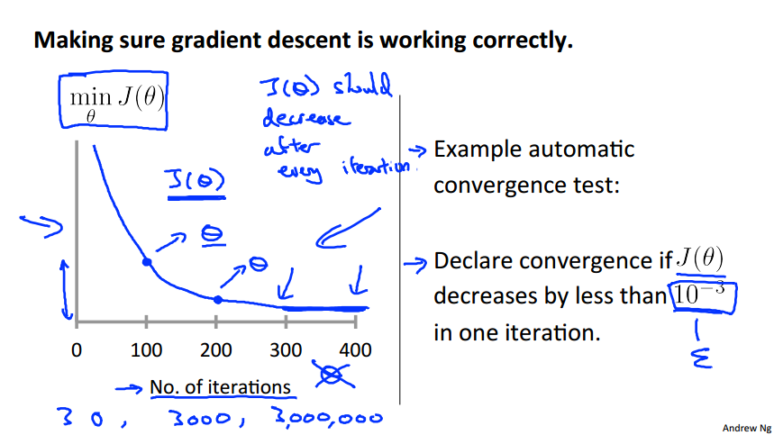

梯度下降算法的每次迭代受到学习率的影响，如果学习率 α 过小，则达到收敛所需的迭代次数会非常高；如果学习率 α 过大，每次迭代可能不会减小代价函数，可能会越过局部最小值导致无法收敛。通常考虑如下学习率：α=0.01， 0.03， 0.1， 0.3， 1， 3， 10

### 特征和多项式回归
线性回归并不适用于所有数据，有时需要曲线或者说多个复杂特征来拟合数据，即多项式回归，此时注意特征归一化。

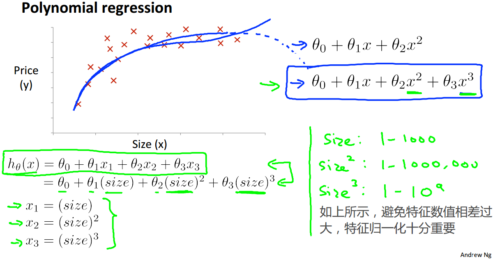

选择好特征（即输入的x，模型的输入是数据特征，而不是纯粹的数据，只有DL是将纯粹的数据输入再自动提取特征）会得到更好的模型，比如房价预测问题，利用房子宽度和长度两个特征不如利用房子面积一个特征，为选择更好的特征需要经验知识和观察数据，以下是平方和根方的选择比较。

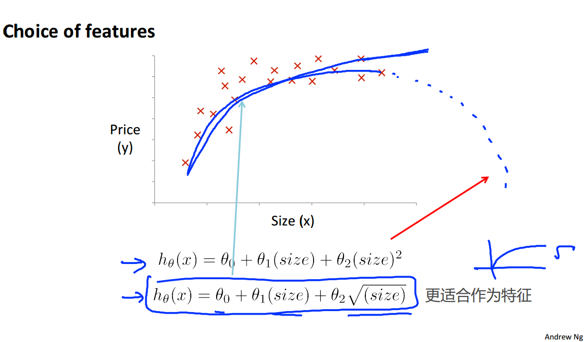

### 正规方程
正规方程是直接求解下面的方程来找出使得代价函数最小的参数：

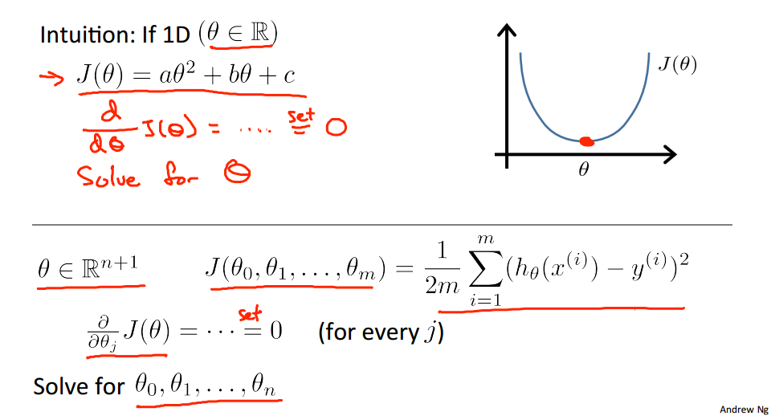

假设我们的训练集特征矩阵为 X（包含了x0=1）并且训练集结果为向量 y，则利用正规方程解出向量的公式为：

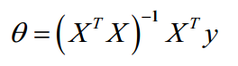

以房价预测为例：

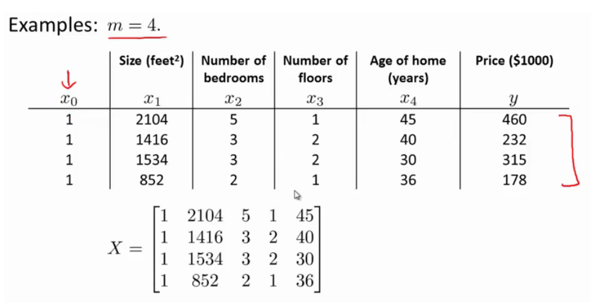

运用正规方程方法求解参数：

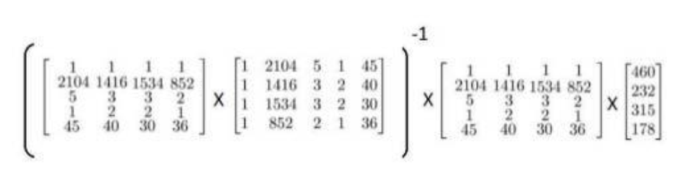

matlab代码为：`pinv(X'*X)*X'*y`

注：对于那些不可逆的矩阵（通常是因为特征之间不独立，如同时包含英尺为单位的尺
寸和米为单位的尺寸两个特征，也有可能是特征数量大于训练集的数量），正规方程方法是不能用的。

梯度下降与正规方程的比较：

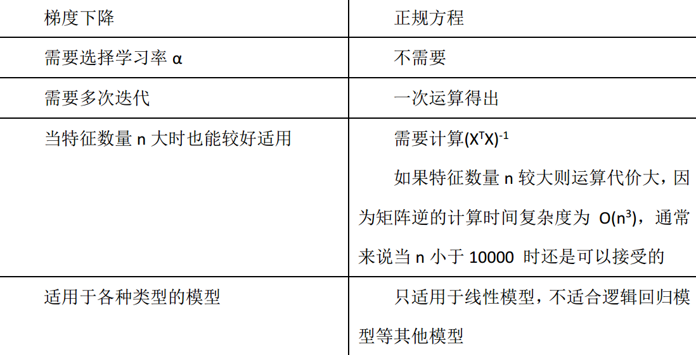

随着后续的学习算法越来越复杂，比如分类算法、逻辑回归算法，对于那些算法并不能使用标准方程法。但对于这个特定的线性回归模型，标准方程法是一个比梯度下降法更快的替代算法。

### 正规方程及不可逆性
当使用正规方程计算`θ=inv(X'X)X'y`时，遇到矩阵$X'X$为不可逆的情况如何处理

> 不可逆矩阵称为奇异或退化矩阵

不可逆出现的原因

-  一个线性方程，来展示那两个相关联的特征值，矩阵 X'X 将是不可逆的，应当避免此类情况
-  用大量的特征值，尝试实践你的学习算法的时候，可能会导致矩阵 X'X 的结果是不可逆的，应当减少特征或者正则化

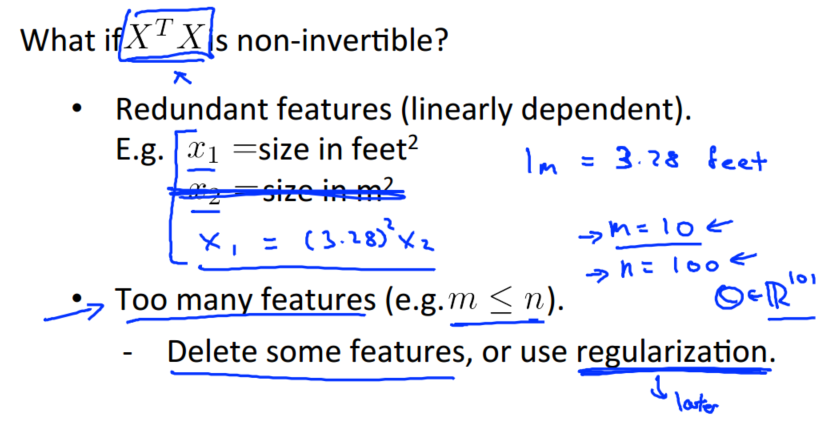

$X'X$的不可逆的问题很少发生，在 Octave 里，有两个函数可以求解矩阵的逆，一个被称为 pinv()，另一个是 inv()，这两者之间的差异是些许计算过程上的，一个是所谓的伪逆，另一个被称为逆。pinv() 函数能计算出 θ 的值，即便矩阵$X'X$是不可逆的。