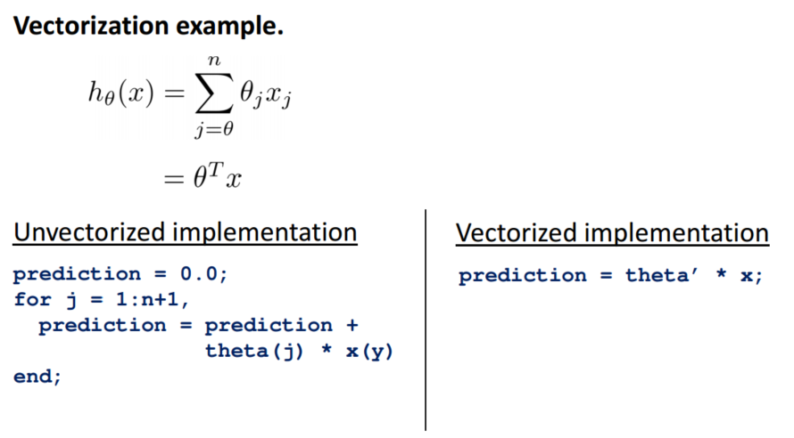
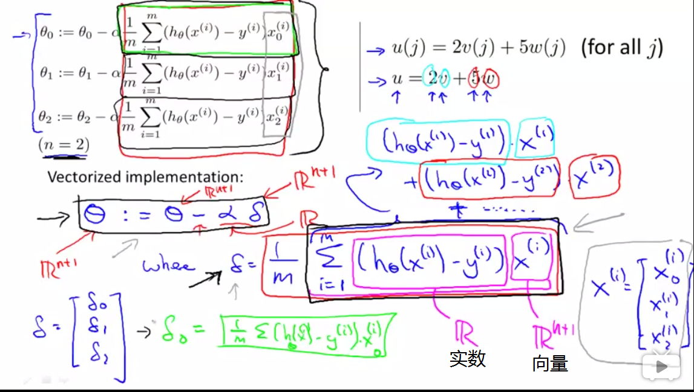

matlab的帮助：doc sound查看的是sound函数的用法，可以用edit sound查看sound函数的源程序，即sound函数运行的原理

### 一些有用的操作

```
V=1： 0.1： 2
#从数值1开始，增量或说是步长为0.1，直到增加到 2，若为说明增量则默认步长为1

ones(2,3)
#元素为1，两行三列的矩阵

zeros(1,3)
#元素为0，一行三列的矩阵

rand(3,3)
# 3x3 矩阵，数值均匀介于0和1之间

randn(1,3)
# 1x3 矩阵，数值符合一个平均值为 0 的高斯分布，方差或者等于 1 的标准偏差。

hist(w)
#hist命令绘制直方图
```

------------

### 数据移动操作
```
size(A)
#返回矩阵的尺寸，可能是多维度的，方便理解应将矩阵看成一层层的包装盒，返回的最后一个维度的尺寸代表最里层包装盒，一般从后往前看不易混淆

size(A, 1)
#第一个维度的尺寸，最外层包装盒

data=load('featureX.dat')
#加载数据

save hello.mat v
#将变量v存成一个叫hello.mat的文件，save hello.txt v -ascii是存为可见的txt文件

A(2,:)
#返回第二行的所有元素，冒号表示该行或该列的所有元素

A([1 3],:)
#返回第一行和第三行的所有元素

A = [A, [100, 101, 102]]
#在原矩阵的右边附加了一个新的列矩阵

C = [A B]
#把两个矩阵直接连在一起，[A; B]为竖着连接

```

------------

### 数据计算操作
```
##a为向量，A为矩阵，一般都是对向量操作再间接对矩阵操作

val=max(a)
#得到向量最大值

max(A,[],1)
#每一列的最大值，1 表示取 A 矩阵第一个维度的最大值

max(A,[],2)
#每一行的最大值，1 表示取 A 矩阵第二个维度的最大值

max(max(A))
#找出整个矩阵 A 的最大值，或者用max(A(:))， 这样做就是把 A 当做一个向量， 并返回 A 向量中的最大值

find(a<3)
#得到向量中哪些元素是小于 3 的

[r,c] = find( A>=7 )
#找出所有 A 矩阵中大于等于 7 的元素， 因此， r 和 c 分别表示行和列

sum(a)
#把向量中所有元素加起来

sum(A,2)
# A 中每一行的和加起来

prod(a)
#返回所有元素的乘积

floor(a)
#向下四舍五入

ceil(a)
#向上四舍五入

#flipup/flipud 表示向上/向下翻转

```

------------

### 绘图数据
```
#画连线图
plot(x,y)

#其余参数表示颜色、点的图形
plot(t, y2,’r’,'*')

#标签
xlabel('time')

#图例
legend('sin', 'cos')

#多个格子
subplot(1,2,1)

#设置坐标轴刻度
axis([0.5 1 -1 1])

#将矩阵生成一个颜色图像， 一个灰度分布图， 并在右边也加入一个颜色条
imagesc(A)， colorbar， colormap gray
```

------------

### 控制语句
> 易忘点：以end结尾，matlab下标以1开头而不是0

```
#循环语句，可以配合break,continue,if使用
indices=1:10;
for i=indices
  v(i)=2^i;
end

#定义和调用函数，y1,y2为返回值，x为输入参数,在主程序调用即可
function y1,y2 = squareThisNumber(x)
y1=x;
y2=x^2;

#添加搜索函数的路径
addpath "C:\Users\ang\desktop" 
```

### 向量化：有助于计算机优化



```
prediction=0;
for j=1:n+1
  prediction=prediction + theta(j)*x(j);
end
#向量化
prediction=theta'*x;
```
技巧是将循环求和改为向量相乘，先列出向量或则矩阵观察，如果是内积则向量化（多步计算要写草稿看看才清楚）


