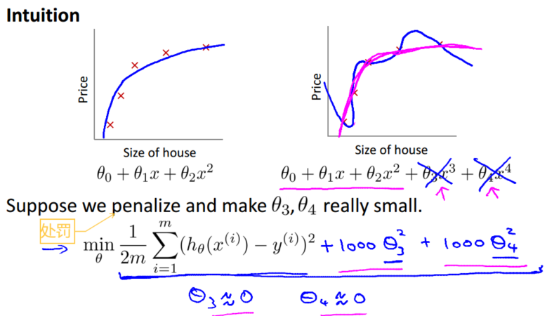
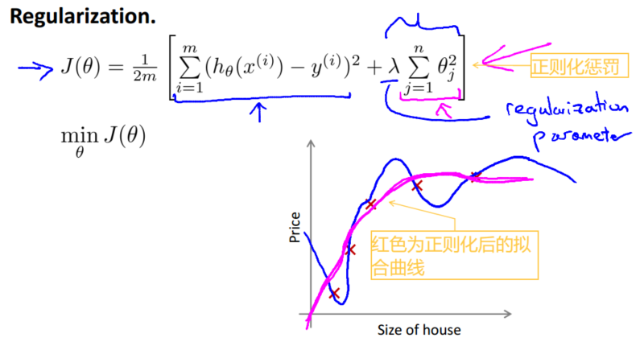
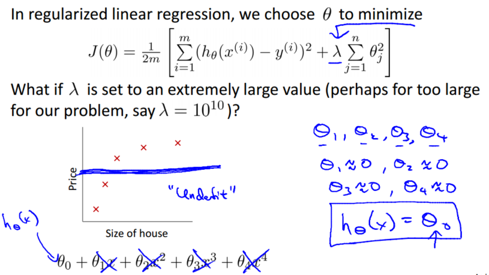
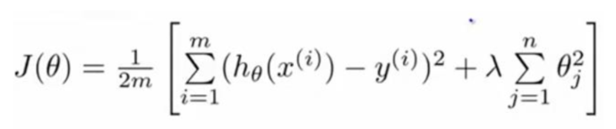
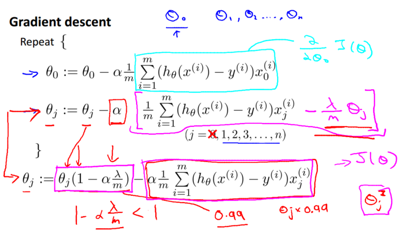
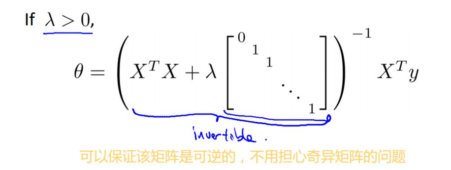
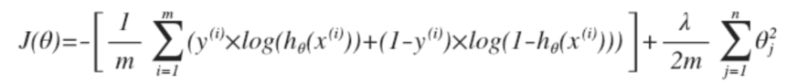
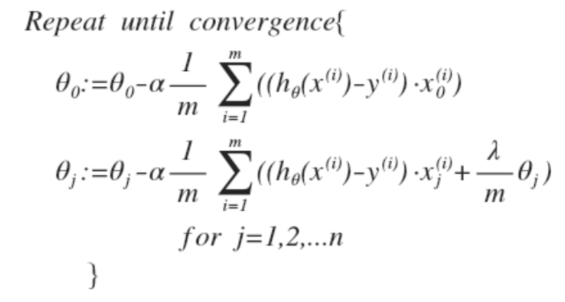
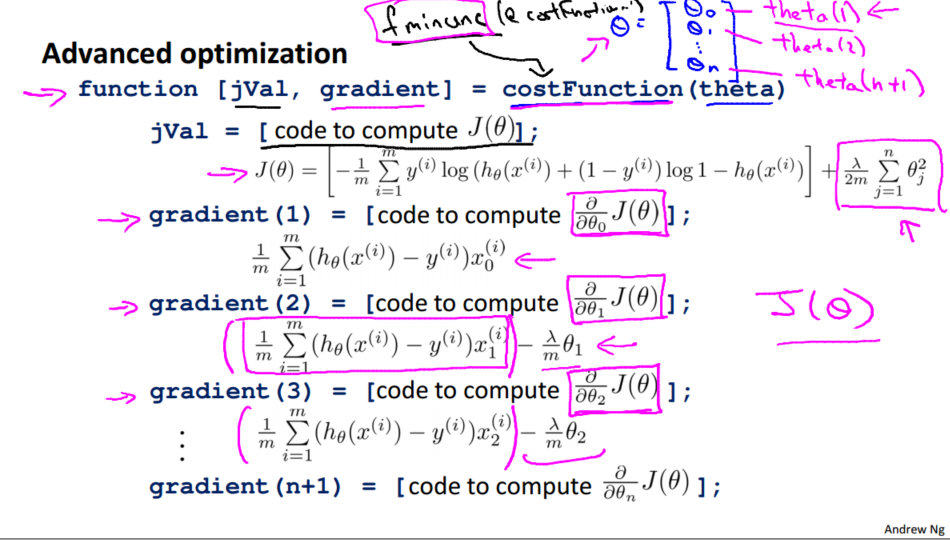

> 查看公式请安装插件[GitHub with MathJax](https://chrome.google.com/webstore/detail/github-with-mathjax/ioemnmodlmafdkllaclgeombjnmnbima)
<!-- TOC -->

- [过拟合](#过拟合)
- [损失函数](#损失函数)
- [正则化线性回归](#正则化线性回归)
- [正则化logistic回归](#正则化logistic回归)

<!-- /TOC -->
### 过拟合
如果我们有非常多的特征，我们通过学习得到的假设能够非常好地适应训练集（代价函数可能几乎为 0），但是无法推广到新的数据集，在新输入变量进行预测时效果不好。

解决办法：
- 丢弃一些不能帮助我们正确预测的特征。可以是手工选择保留哪些特征，或者使用一些模型选择的算法来帮忙（例如 PCA）
- 正则化。保留所有的特征，但是减少参数的大小（ magnitude），当特征很多时效果不错

### 损失函数
如下图所示，特征过多容易导致过拟合，如果能让特征的系数 θ 接近于 0 的话，将有效避免该问题。

为一定程度上减小这些参数 θ 的值，往损失函数添加正则化惩罚，并且让代价函数最优化算法来选择惩罚的程度（一般不对$θ_0$惩罚），得到：

如果选择的正则化参数 λ 过大，则会把所有的参数都最小化，导致模型变成$h_θ(x)=θ_0$，造成欠拟合，如下图将变成一条直线：

所以对于正则化，要取一个合理的λ的值，才能更好的应用正则化。

### 正则化线性回归
将正则化应用于线性回归：

对于线性回归的求解，之前推导了两种学习算法：一种基于梯度下降，一种基于正规方程。

使用梯度下降法令这个代价函数最小化，由于未对$θ_0$进行正则化，所以梯度下降算法将分为两个式子：

可以看出，正则化线性回归的梯度下降算法的变化在于，每次都在原有算法更新规则的基础上令 θ 值减少一个额外的值。

此外，可以利用正规方程来求解正则化线性回归模型，方法如下所示：

### 正则化logistic回归
将正则化应用于logistic回归：

通过求导，得出梯度下降算法为：

注：看上去同线性回归一样，但是知道$h_θ(x)=g(θ^TX)$，所以与线性回归不同。

之前学习过许多更高级的优化算法，调用 fminuc 函数来求解代价函数最小化的参数，只需要提供损失函数值及其偏导数项。

