> 查看公式请安装插件[GitHub with MathJax](https://chrome.google.com/webstore/detail/github-with-mathjax/ioemnmodlmafdkllaclgeombjnmnbima)
<!-- TOC -->

- [SVM概述](#svm概述)
- [SVM损失函数及理解](#svm损失函数及理解)
    - [西瓜书](#西瓜书)
    - [Ng课程](#ng课程)
- [核函数](#核函数)
- [使用SVM](#使用svm)
- [SVM与NN](#svm与nn)

<!-- /TOC -->
### SVM概述
与逻辑回归和神经网络相比，支持向量机（简称 SVM），在学习复杂的非线性方程时提供了一种更为清晰，更加强大的方式。

> Ng课程是由logistic改进为SVM算法，而西瓜书是由划分超平面的支持向量逐步推出，两者想法大不相同，西瓜书更加专业。

支持向量机方法的三要素
- 基本模型:间隔最大的线性分类器；若用上核技巧，成为实质上的非线性分类器
- 学习策略:间隔最大化，可形式化为一个求解凸二次规划的问题
- 学习算法:求解凸二次规划的最优化算法，如序列最小最优算法(SMO)

### SVM损失函数及理解
#### 西瓜书
给定训练样本集D，分类学习最基本的想法就是基于训练集D在样本空间中找到一个划分超平面，将不同类别的样本分开，如下图所示：

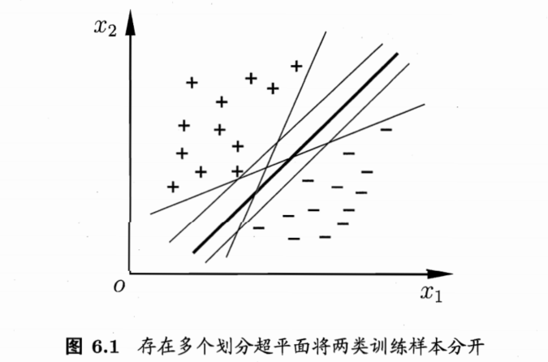

图中粗线对应的超平面性能最好，在各类问题中的目标即找出最优的超平面。

在样本空间中，划分超平面可通过如下线性方程来描述：$w^T x+b=0$，其中$w=(w_1;w_2;...;w_d)$为法向量，决定了超平面的方向；b为位移项，决定了超平面与原点之间的距离；样本空间中任意点x到超平面$(w,b)$的距离可写为：

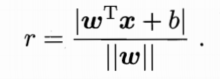

假设超平面(w,b)能将训练样本正确分类，预测公式能符合以下缩放变换：

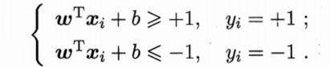

绘图如下：

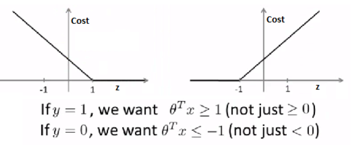

距离超平面最近的几个训练样本点使上式成立，被称为“支持向量”，两个异类支持向量到超平面的距离之和为：

绘图如下：

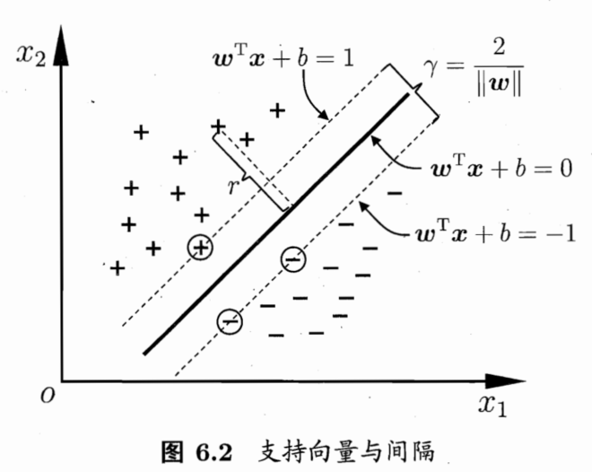

欲找到具有“最大间隔”的划分超平面，目标函数如下，也是 SVM 的基本型：

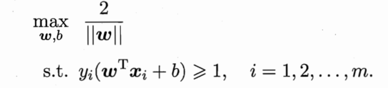

通过拉格朗日乘子法变换到对偶变量(dual variable) 的优化问题之后，可以找到一种更加有效的方法来进行求解。

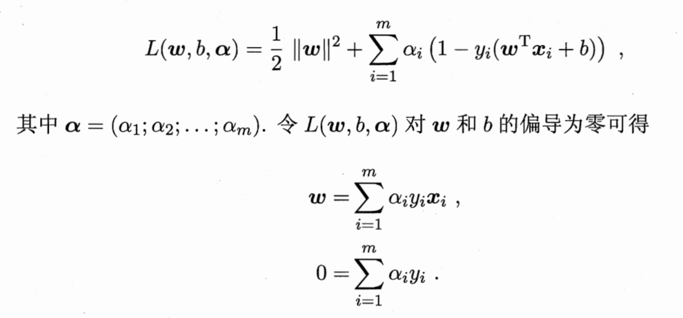

有时难以找到完全分开样本的超平面，或者容易过拟合，缓解问题的办法是允许支持向量机在一些样本出错，将优化目标改为：

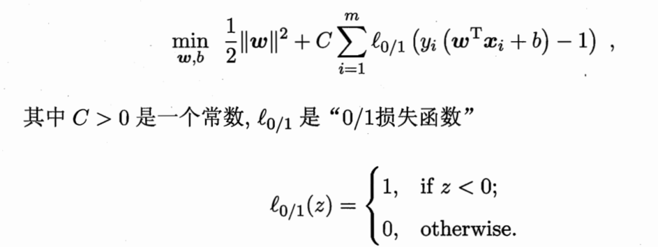

显然，当C为无穷大时，优化函数迫使所有样本均满足约束；当C取有限值时，允许一些样本不满足约束。

$l_{0/1}$(“0/1损失函数”)非凸、非连续，常被其他一些函数替代，比如hinge损失、指数损失、对率损失。

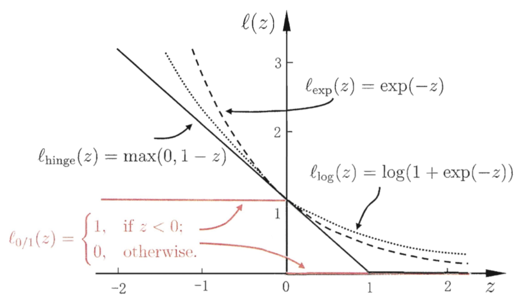

#### Ng课程
将logistic的损失函数曲线修改为蓝色线条，左右分别是$cost_1(z)$和$cost_0(z)$，即$cost_y(z)$：

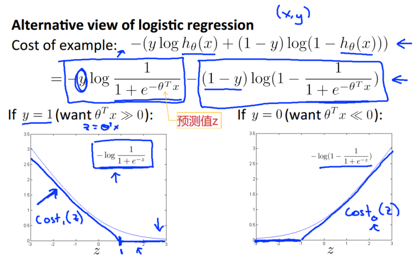

使用新的cost函数对逻辑回归的最小化问题进行替代，拿掉与最小化不相关的值m，最后再去掉 λ 并加上常数项C（将 C 当成1/λ来控制权衡，优化结果是一致的）,得到支持向量机的最小化目标：

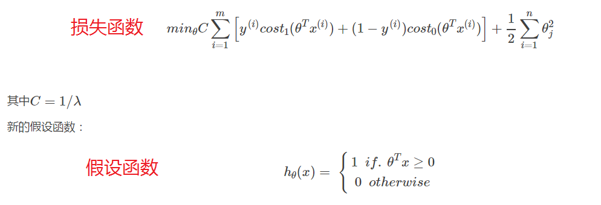

直观理解是将支持向量机看作是大间距分类器（Large Margin Intuition），对比假设函数与损失函数会发现SVM的要求分类时加入安全的间距因子（此处为1）。

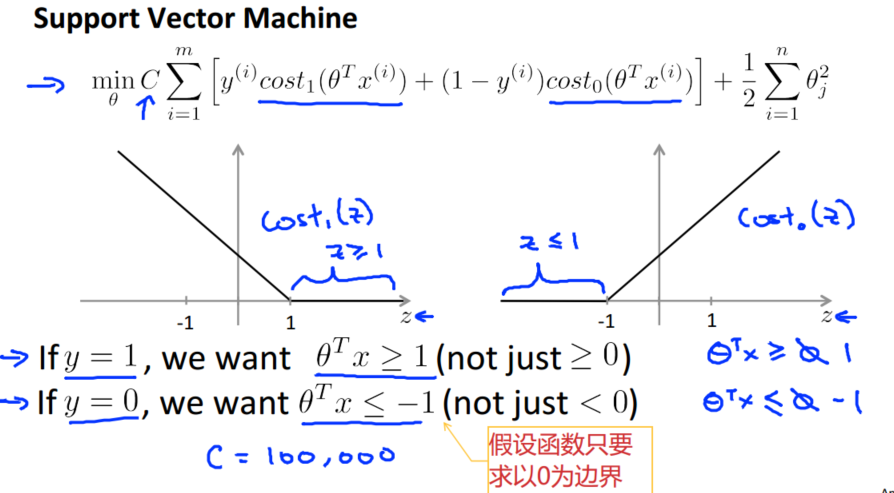

当C较大时训练得到SVM会有最大间距的决策分界线，如下图中的黑线所示, 而不是绿线或者粉线：

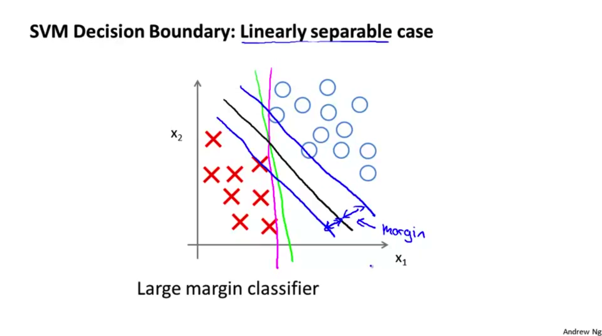

证明的过程为，将当常数C很大时，我们需要选择合适的参数使得∑项等于0，此时优化目标为：

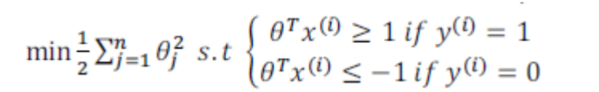

结合cost函数以及内积知识，可以明白该优化问题是如何得到一个大间距分类器的：

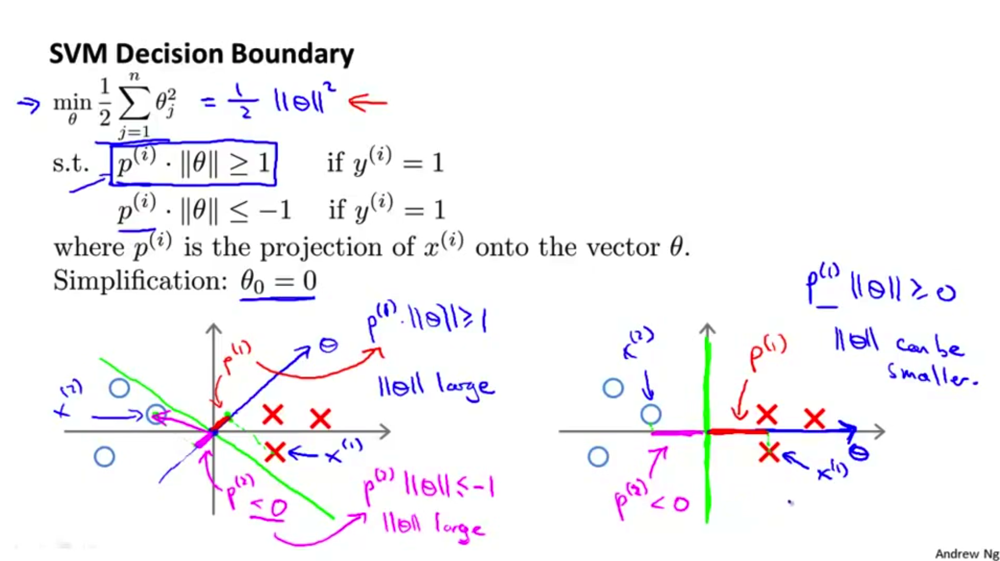

注意C=1/λ
- C较大时，相当于 λ 较小，可能会导致过拟合，高方差。
- C较小时，相当于 λ 较大，可能会导致低拟合，高偏差。

### 核函数
之前的讨论的前提是样本为线性可分，当样本的判定边界为复杂的曲线时，可将样本从原始空间映射到更高维的特征空间，使得样本在这个特征空间内线性可分，再使用SVM。

在映射的过程，需要计算从输入空间映射到特征空间得到的特征向量之间的内积，可以利用核函数(kernel function)解决。通过使用核函数可以学习非线性支持向量机，等价于隐式地在高维空间的特征空间中学习线性支持向量机；也就是说，在核函数K(x,z)给定的条件下，可以利用解线性分类问题的方法去求解非线性分类问题的支持向量机。

几个常用核函数：

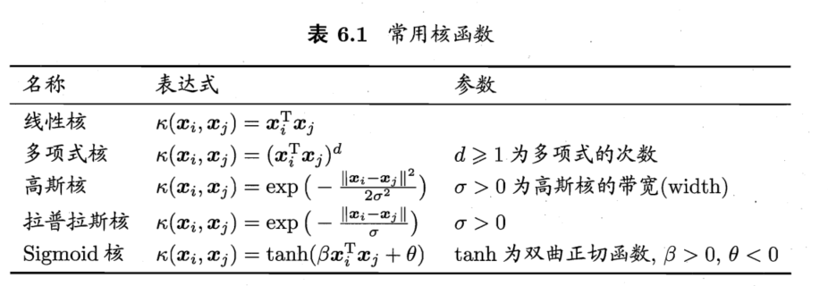

以高斯核为例（f即核函数），将SVM修改如下：

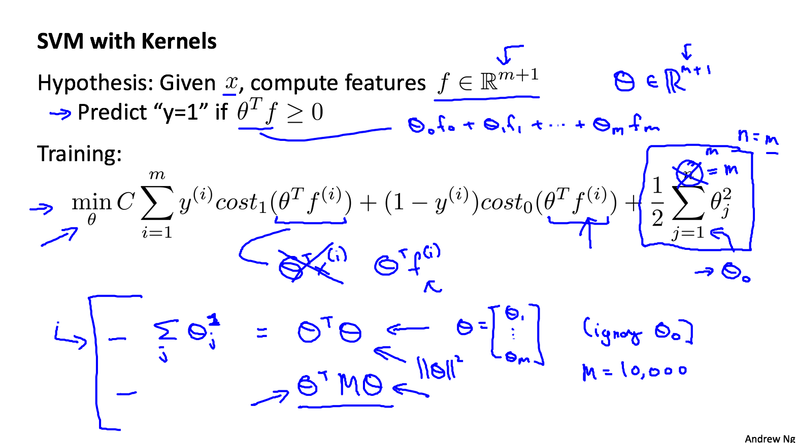

关于C和σ的值对于bias和variance的影响（高斯核例子）：
- 如果C较大，我们会得到更高的方差，更低的偏差（λ小，过拟合） 
- 如果C较小，我们会得到更低的方差，更高的偏差（λ大，解决了过拟合） 
- 如果σ2较大，特征fi变化的更平滑，导致更高的偏差和更低的方差 
- 如果σ2较小，特征fi变化的更陡峭，导致更低的偏差和更高的方差

需要注意的是, 在使用Gaussian核函数之前需要进行feature scaling.

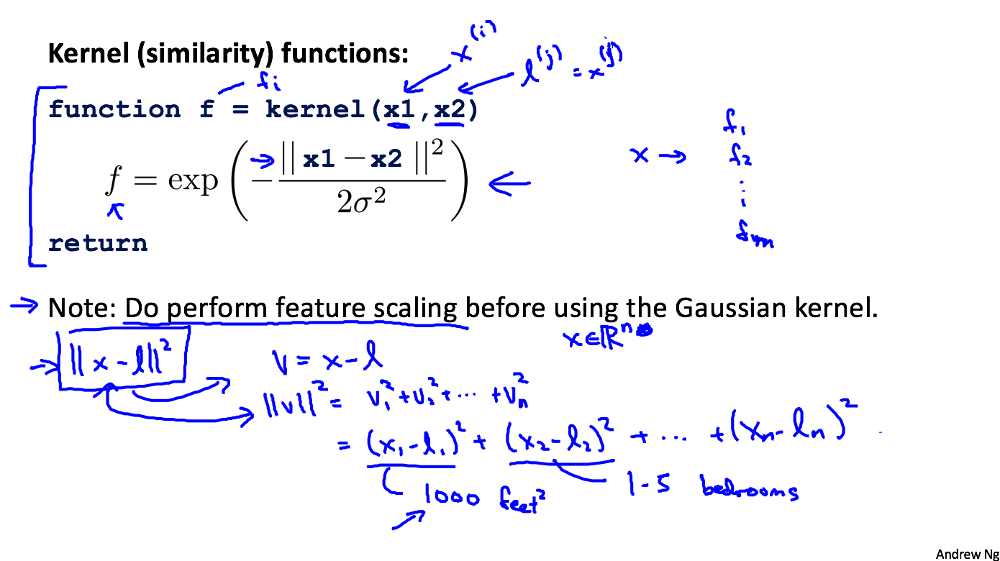

### 使用SVM
在实际应用过程中，有很多写好的SVM库可以用，推荐使用 liblinear 和 libsvm，需要做的工作主要有 
- 选择参数C,与偏差/方差有关
- 选择核函数及其参数（即相似性函数），也可以不使用核函数（即线性核函数），相当于一个标准的线性分类器 
- n为特征数，m为训练样本数，下面是一些适用的准则（逻辑回归和不带核函数的支持向量机是相似的算法，而学习复杂的非线性函数是带核SVM尤其突出）
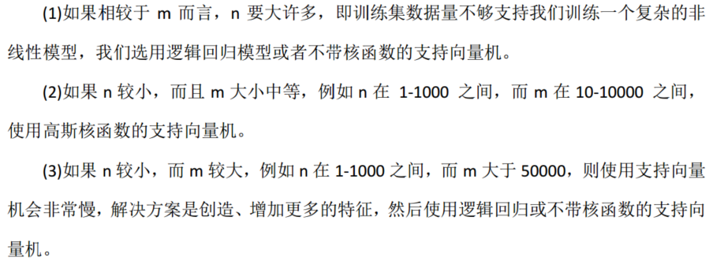

面对多元分类问题：许多SVM包已经内置了多元分类，也可以使用 one-vs-all 的方法进行多元分类，类似之前的逻辑回归。

### SVM与NN
对于所有的这些问题，对于所有的这些不同体系
一个设计得很好的神经网络也很有可能会非常有效。

有一个缺点是，或者说是有时可能不会使用神经网络的原因是：对于许多这样的问题，神经网络训练起来可能会特别慢，但是如果你有一个非常好的 SVM 实现包，它可能会运行得比较快比神经网络快很多，而且 SVM 是一种凸优化问题，因此好的 SVM 优化软件包总是会找到全局最小值，或者接近它的值。

不用过于纠结使用logistic、SVM还是NN，重要在于：你有多少数据，你有多熟练是否擅长做误差分析和排除学习算法，指出如何设定新的特征变量和找出其他能决定你学习算法的变量等技巧

